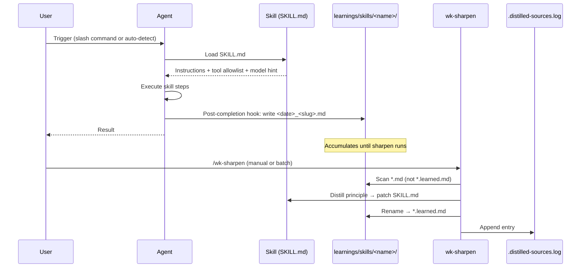
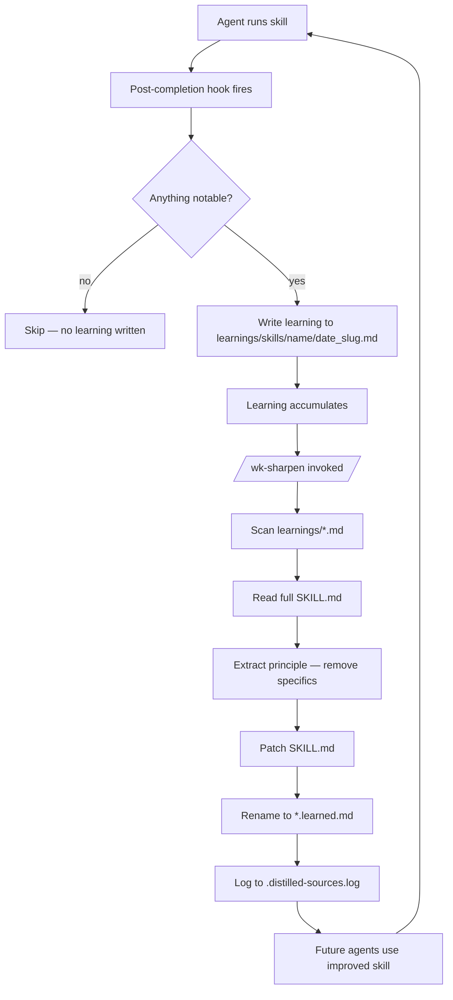
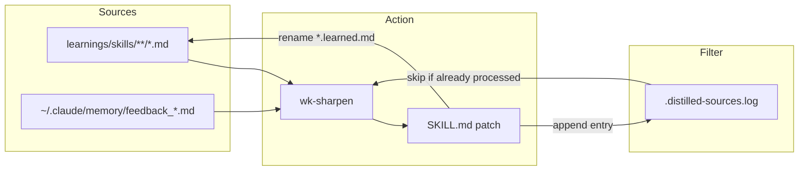
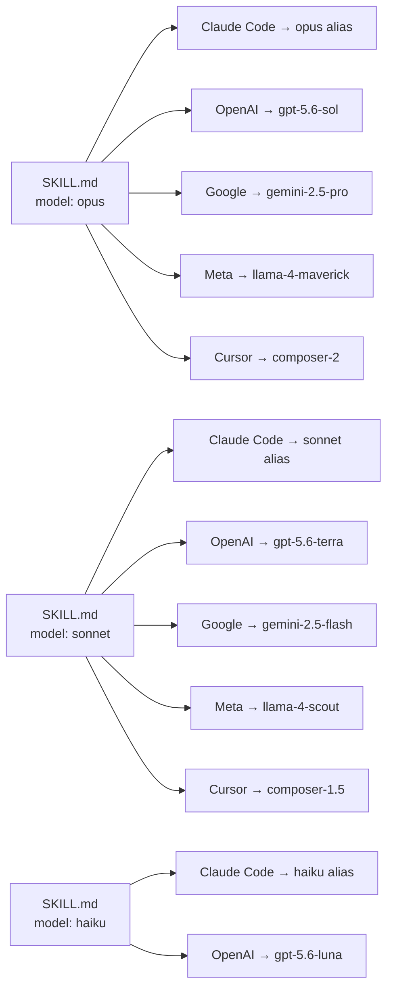

# Skills Architecture

A self-improving agent skill system. Skills teach agents *how* to do things.
Agents write retrospective notes when they finish. Those notes are distilled
back into the skills — so every future run benefits from every past mistake.

---

## How a Skill Works

Each skill is a single `SKILL.md` file with YAML frontmatter and markdown
instructions. The frontmatter declares when to activate, which tools to allow,
which model to use, and per-provider model overrides for cost control.

```
skills/
└── pr-resolve/
    └── SKILL.md          ← frontmatter + instructions
learnings/
└── skills/
    └── pr-resolve/
        ├── 2026-04-21_pending-review.md        ← raw learning
        └── 2026-04-21_pending-review.learned.md ← after distillation
.distilled-sources.log    ← tracks what has been processed
```

### Skill Frontmatter

```yaml
name: wk-pr-resolve
description: >-
  Address PR review comments interactively ...  ← agent trigger text
model: opus                                      ← Claude Code model alias
effort: high                                     ← Claude Code effort
allowed-tools: [Bash, Read, Edit, Write, ...]   ← capability sandbox
metadata:
  version: '2026.04.22-070656'                  ← CalVer timestamp
  model:
    openai:  gpt-5.6-sol     ← OpenAI provider hint
    google:  gemini-2.5-pro
    meta:    llama-4-maverick
```

---

## Lifecycle: One Skill Execution



---

## The Self-Improvement Loop



---

## Memory Sources: Two Input Channels for Sharpen

[`wk-sharpen`](../skills/sharpen/README.md) pulls from two sources in batch mode:



**Learnings** — structured field reports written by agents after each run.
Contain skill name, type, severity, and a suggested fix.

**Global memory** — `~/.claude/memory/feedback_*.md` files from any session
in any project. Sharpen reads feedback-type memories and maps them to the
skill they describe.

---

## Agent-Agnostic Model Routing

Every skill declares a Claude Code model tier (`haiku`, `sonnet`, or `opus`),
an effort level, and a per-provider recommendation table. Claude Code consumes
the top-level fields. Codex discovers a skill from `name` and `description`;
provider-aware launchers or subagent dispatch may consume
`metadata.model.openai`.



Low-complexity skills use `haiku` or `sonnet`; high-reasoning skills use
`opus`. The staged-frontmatter hook enforces the OpenAI mapping without
rewriting Claude's native annotation.

---

## Skill Inventory

| Skill | Tier | Role |
|-------|------|------|
| [`wk-workflow`](../skills/workflow/README.md) | opus | Master orchestration — invokes all others |
| [`wk-pr-review`](../skills/pr-review/README.md) | opus | Thorough adversarial code review |
| [`wk-sharpen`](../skills/sharpen/README.md) | opus | Distill learnings → improve skills |
| [`wk-pr-resolve`](../skills/pr-resolve/README.md) | sonnet | Address reviewer feedback interactively |
| [`wk-pr`](../skills/pr/README.md) | sonnet | Create and manage pull requests |
| [`wk-commit`](../skills/commit/README.md) | sonnet | Conventional commits with signing |
| [`wk-self-review`](../skills/self-review/README.md) | sonnet | Post design-decision comments on own PR |
| [`wk-retro`](../skills/retro/README.md) | sonnet | Session retrospective → global memory |
| [`wk-buildkite`](../skills/buildkite/README.md) | sonnet | CI investigation and log reading |
| [`wk-docs`](../skills/docs/README.md) | sonnet | Keep documentation in sync with code |
| [`wk-mise`](../skills/mise/README.md) | sonnet | Runtime version management |
| [`wk-docker`](../skills/docker/README.md) | sonnet | Image builds, daemon issues |
| [`wk-datadog`](../skills/datadog/README.md) | sonnet | Dashboards, monitors, SLOs |
| [`wk-gh`](../skills/gh/README.md) | sonnet | GitHub CLI scoped to org |
| [`wk-calver`](../skills/calver/README.md) | sonnet | Generate CalVer version strings |
| [`wk-worktree-cleanup`](../skills/worktree-cleanup/README.md) | sonnet | Prune merged git worktrees |

---

## Installation

```bash
# Install all skills globally
npx skills add whizzzkid/skills

# Install a single skill
npx skills add whizzzkid/skills -s pr-resolve

# After editing skills locally, reinstall
npx skills add . -g -y --agent claude-code
```

Skills are installed into `~/.claude/skills/` and discovered automatically
by the agent at session start. The `description` field in frontmatter is
what the agent reads to decide whether to activate a skill.

---

## Environment Variables

| Variable | Used by | Purpose |
|----------|---------|---------|
| `WK_SKILLS_HOME` | All skills | Path to this repo — required for learning capture |
| `GITHUB_ORG` | gh, sitrep | Scope GitHub queries to org |
| `DATADOG_API_KEY` | datadog | API access |
| `DATADOG_APP_KEY` | datadog | Read/write access |
| `WK_SKILLS_TEAM_SLACK_HANDLE` | team-hud | CSV of Slack usergroup handles; resolved to channels via cache |
| `WK_SKILLS_TEAM_JIRA` | team-hud | Comma-separated Jira project keys |
| `WK_SKILLS_TEAM_GITHUB` | team-hud | GitHub org or org/repo filter |
