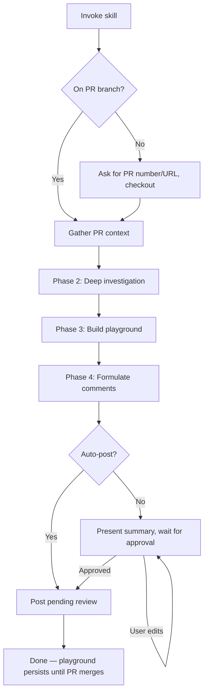

# PR Review Skill Design

## Overview

A skill that automates thorough, critical code reviews on GitHub pull requests. The agent investigates changes, builds a playground to validate assumptions, and creates pending review comments with an encouraging, non-blocking tone.

## Workflow



## Phases

### Phase 1: Context

- Detect current branch. If it has an open PR, use it. If on main/master, ask for PR number or URL.
- Checkout the PR branch if not already on it.
- Collect: PR title, description, full diff, changed file list, commit log, linked issues.
- Identify the base branch and scope of changes.

### Phase 2: Investigation

- Read every changed file in full — not just the diff hunks, but surrounding context.
- Trace call sites, downstream consumers, and test coverage for changed code.
- Be adversarial: look for bugs, missed edge cases, security issues, performance regressions, broken contracts, race conditions, and anything the author might have overlooked.
- No fixed checklist — the agent decides what matters based on the actual changes.

### Phase 3: Playground

- Create `.review-playground/` at repo root.
- Add `.review-playground/` to `.gitignore` if not already present (never commit these files).
- Build a combination of:
  - **Scratch scripts** — exercise changed code paths, reproduce behavior.
  - **Test cases** — verify correctness, probe edge cases and failure modes.
  - **HTML visualizations** — when changes benefit from visual explanation (UI changes, data flow, state transitions, critical change maps).
- Run experiments and report findings: confirmed behaviors, broken assumptions, surprising results.
- Playground files persist until the upstream PR merges. Cleanup is manual — the user deletes `.review-playground/` when done, or the agent offers to clean up if invoked again after the PR is merged.

### Phase 4: Review Comments

- Formulate inline comments anchored to specific lines in the diff.
- **Tone**: Encouraging and constructive. Bring concerns across without blocking.
- **Severity levels**:
  - `blocker` — Must be fixed before merge. Used sparingly for critical bugs, security issues, data loss risks.
  - `suggestion` — Good for a follow-up change. Style nits, naming, refactoring ideas, pedantic observations.
  - `question` — Genuine uncertainty. Ask the author to clarify intent or confirm behavior.
  - `praise` — Call out good patterns, clever solutions, or well-handled edge cases.
- Unless something is a critical blocker, default to `suggestion` and frame as "good for a follow-up."
- Present a numbered summary of all proposed comments for the user to review.

### Phase 5: Post

- **Default behavior (stop-and-ask)**: Show the full comment list. User can approve, edit, reword, or skip individual comments. Then post the approved set.
- **Auto-post mode**: If the user explicitly requests auto-post when invoking, skip the interactive gate and post immediately.
- Create a **pending review** via GitHub API (`gh api`). The review is not submitted — the user submits it from GitHub when ready.
- Top-level review body: `"Reviewing with the help of {agent-name}, please let me know if it's annoying or noisy or not useful."`
- The `{agent-name}` is derived from the agent in use (e.g., "Claude Code", "Cursor", "Copilot") or defaults to "an AI coding assistant."

## GitHub API: Pending Review

Create a pending review with all comments in a single API call:

```bash
gh api repos/{owner}/{repo}/pulls/{number}/reviews \
  --method POST \
  --input - <<EOF
{
  "body": "Reviewing with the help of {agent-name}, please let me know if it's annoying or noisy or not useful.",
  "event": "PENDING",
  "comments": [
    {
      "path": "src/file.ts",
      "line": 42,
      "body": "**suggestion**: Consider extracting this into a helper — good candidate for a follow-up.\n\n---\n*🤖 AI-assisted review*"
    }
  ]
}
EOF
```

The pending review stays as a draft until the user clicks "Submit review" on GitHub or the agent submits it via API.

## File Structure

```
skills/pr-review/
  SKILL.md       # The skill definition
```

## Constraints

- SKILL.md must stay under 500 lines.
- Playground files are never committed to git.
- The skill targets agents with shell access and `gh` CLI (primarily Claude Code, but portable).
- Review comments must reference actual diff lines — no comments on unchanged code.
