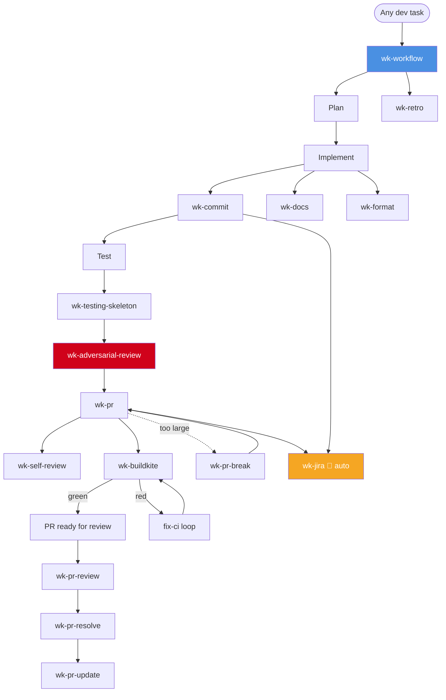
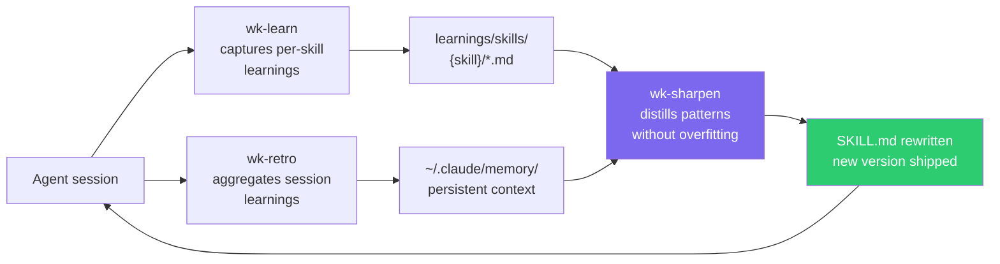

# wk-skills Index

> **32 skills** organized into four groups. This file is an owned artifact — see [AGENTS.md](../AGENTS.md#readme-maintenance) for maintenance rules.

---

## Quick Start

```bash
npx skills add whizzzkid/skills   # install all skills globally
npx skills add .                  # install from local clone
```

Skills activate automatically when the agent detects a matching context, or invoke manually via `/wk-<name>`.

---

## Skill Groups

### 🌅 Rituals — day-shaping routines

| Skill | Purpose | Invocation |
|---|---|---|
| `wk-goodmorning` | Prepare for your day — surfaces unread messages, meeting prep, PRs, and carry-over items | User: `/wk-goodmorning` |
| `wk-goodevening` | Wrap up your workday — brag doc, Granola learnings, Lattice feedback, unfinished items | User: `/wk-goodevening` |
| `wk-cal` | All Google Calendar operations — fetch, create in free slots, check availability, schedule prep blocks | User + Model |
| `wk-retro` | Session retrospective — capture learnings and improve future sessions | User + Model |
| `wk-self-perf` | Generate a self-performance review narrative from GitHub, Slack, Jira, Granola, and more | User: `/wk-self-perf <period>` |

---

### 🔀 Pull Request — PR lifecycle management

| Skill | Purpose | Invocation |
|---|---|---|
| `wk-pr` | Create a PR and manage the post-PR workflow — draft, CI poll, self-review, ready | User + Model |
| `wk-pr-review` | Thorough adversarial code review with inline comments via GitHub API | User + Model |
| `wk-pr-resolve` | Address review comments interactively — implement fixes, prepare responses | User + Model |
| `wk-pr-update` | Update a PR branch from its base — rebase (<5 commits) or patch-replay | User + Model |
| `wk-pr-break` | Split an oversized PR into a reviewable, individually-shippable stack | User + Model |
| `wk-adversarial-review` | Pre-flight adversarial review before any push or PR transition | Auto (pre-push) |
| `wk-self-review` | Post inline self-review comments documenting design decisions for human reviewers | User + Model |
| `wk-jira` | Sync Jira ticket state with PR lifecycle — auto-transitions, description audit | Auto (on Jira key/URL) |

---

### 🛠️ Tools — external service integrations

| Skill | Purpose | Invocation |
|---|---|---|
| `wk-buildkite` | Buildkite CI — check status, investigate failures, view logs, monitor builds | User + Model |
| `wk-datadog` | Create and manage Datadog dashboards, monitors, SLOs, and notebooks | User + Model |
| `wk-docker` | Docker — build images, inspect containers, debug Dockerfiles, troubleshoot daemon | User + Model |
| `wk-devcontainer` | Generate devcontainer for Rails/mise projects with Dockerfile, docker-compose, devcontainer.json | User + Model |
| `wk-mise` | Manage mise tool versions — install, configure .mise.toml, diagnose missing tools | User + Model |
| `wk-gh` | Scope all `gh` CLI operations to `$GITHUB_ORG` — auto-fires on any GitHub interaction | Auto (on gh CLI use) |

---

### ⚙️ Workflows — development process primitives

| Skill | Purpose | Invocation |
|---|---|---|
| `wk-workflow` | **Master orchestrator** — Plan → Implement → Test → Review → PR → CI → Retro | Auto (any dev task) |
| `wk-commit` | Conventional commits with emoji, signing, and safe push | User + Model |
| `wk-docs` | Check and update documentation affected by code changes | User + Model |
| `wk-testing-skeleton` | Frame the test plan for any code change — behavioral over structural, happy+sad paths | Auto (before writing tests) |
| `wk-format` | Apply code-formatting preferences reconciled with repo lint config | Auto (before writing code) |
| `wk-refactor` | Validate a refactor preserved behavior — removed-line audit, diff classification | User + Model |
| `wk-markdown` | Enforce 120-col line width, heading hierarchy, Mermaid diagrams, validated links | Auto (on .md edits) |
| `wk-concise` | Reduce response verbosity — drop filler, keep technical precision | User: `/concise` |
| `wk-calver` | Generate CalVer version strings (YYYY.MM.DD-HHMMSS UTC) — replaces semver | Auto (on version bumps) |
| `wk-learn` | Capture per-skill learnings after each run → `learnings/skills/{skill}/` | User + Model |
| `wk-sharpen` | Distill field reports into SKILL.md improvements without overfitting on examples | User + Model |
| `wk-skill` | Scaffold a new wk-* skill from the canonical template | User + Model |
| `wk-worktree-cleanup` | Clean up git worktrees whose branches have been merged | User + Model |

---

## Development Workflow



---

## Learning & Self-Improvement Loop



The cycle: **session → learn → retro → sharpen → better skills → next session**.

- `wk-learn` is called at the end of each skill run with the skill's short name as argument.
- `wk-retro` promotes session-level learnings to `~/.claude/memory/` for cross-session persistence.
- `wk-sharpen` reads learning files and rewrites `SKILL.md` bodies to encode generalizable principles.
- All versions are CalVer (`YYYY.MM.DD-HHMMSS` UTC) — semver is forbidden.

---

## Anti-Drift

`skills/README.md` is an **owned artifact**, not generated documentation.
See [AGENTS.md § README Maintenance](../AGENTS.md#readme-maintenance) for the full maintenance contract:
update this file whenever a skill is added, removed, or its group/description changes.
