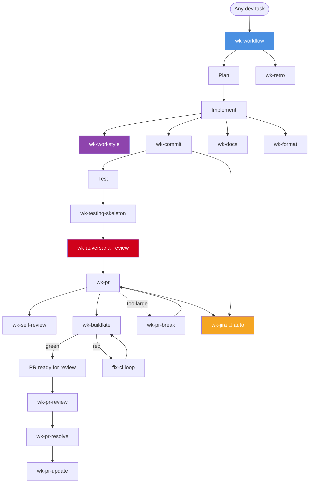
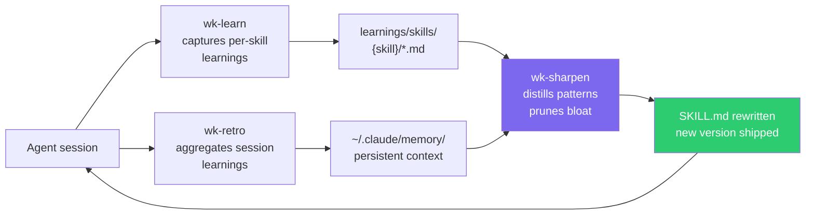

# wk-skills Index

> **62 skills** organized into five groups. This file is an owned artifact — see
> [AGENTS.md](../AGENTS.md#readme-maintenance) for maintenance rules. The root
> [README.md](../README.md) carries a mirror table; the `check-readme-index`
> pre-commit hook keeps both in sync with the `skills/` tree.

---

## Quick Start

```bash
npx skills add whizzzkid/skills   # install all skills globally
npx skills add .                  # install from local clone
```

Skills activate automatically when the agent detects a matching context, or invoke manually via `/wk-<name>`.

---

## Skill Groups

### 🌅 Rituals — day-shaping routines

| Skill | Purpose | Invocation |
|---|---|---|
| [`wk-sitrep`](./sitrep/README.md) | Unified daily ops log — SilverBullet live.md replaces the former morning and evening standalone skills with no HTML generation | User: `/wk-sitrep [start\|end]` |
| [`wk-cal`](./cal/README.md) | All Google Calendar operations — fetch, create in free slots, check availability, schedule prep blocks | User + Model |
| [`wk-retro`](./retro/README.md) | Session retrospective — capture learnings and improve future sessions | User + Model |
| [`wk-self-perf`](./self-perf/README.md) | Generate a self-performance review narrative from GitHub, Slack, Jira, Granola, and more | User: `/wk-self-perf <period>` |
| [`wk-team-hud`](./team-hud/README.md) | ⚠️ WIP — heads-up display of team activity; blocked on Slack/Jira/Group roster access | — |

---

### 🔀 Pull Request — PR lifecycle management

| Skill | Purpose | Invocation |
|---|---|---|
| [`wk-pr`](./pr/README.md) | Create a PR and manage the post-PR workflow — draft, CI poll, self-review, ready | User + Model |
| [`wk-pr-review`](./pr-review/README.md) | Thorough adversarial code review with inline comments via GitHub API | User + Model |
| [`wk-pr-resolve`](./pr-resolve/README.md) | Address review comments interactively — implement fixes, prepare responses | User + Model |
| [`wk-pr-update`](./pr-update/README.md) | Update a PR branch from its base — rebase (<5 commits) or patch-replay | User + Model |
| [`wk-pr-break`](./pr-break/README.md) | Split an oversized PR into a reviewable, individually-shippable stack | User + Model |
| [`wk-pr-takeover`](./pr-takeover/README.md) | Take over a PR from another author — overwrite or stack mode, full workflow, co-authorship | User + Model |
| [`wk-pr-merge`](./pr-merge/README.md) | Merge after review clearance — ticket, retro, cleanup | User + Model |
| [`wk-adversarial-review`](./adversarial-review/README.md) | The single review gate — one run per change at the completion gate, before merge | Auto (once, pre-merge) |
| [`wk-self-review`](./self-review/README.md) | Post inline self-review comments documenting design decisions for human reviewers | User + Model |
| [`wk-jira`](./jira/README.md) | Sync Jira ticket state with PR lifecycle — auto-transitions, description audit | Auto (on Jira key/URL) |

---

### 💬 Communication — outbound messaging

| Skill | Purpose | Invocation |
|---|---|---|
| [`wk-slack`](./slack/README.md) | Compose and send Slack messages — announcements, review requests, status updates — in mrkdwn | User + Model |

---

### 🛠️ Tools — external service integrations

| Skill | Purpose | Invocation |
|---|---|---|
| [`wk-buildkite`](./buildkite/README.md) | Buildkite CI — check status, investigate failures, view logs, monitor builds | User + Model |
| [`wk-datadog`](./datadog/README.md) | Create and manage Datadog dashboards, monitors, SLOs, and notebooks | User + Model |
| [`wk-colima`](./colima/README.md) | Colima — ensure VM is running before container ops, start with dynamic CPU, restart cleanly on failure | User + Model |
| [`wk-docker`](./docker/README.md) | Docker — build images, inspect containers, debug Dockerfiles, troubleshoot daemon | User + Model |
| [`wk-devcontainer`](./devcontainer/README.md) | Generate devcontainer for Rails/mise projects with Dockerfile, docker-compose, devcontainer.json | User + Model |
| [`wk-mise`](./mise/README.md) | Manage mise tool versions — install, configure .mise.toml, diagnose missing tools | User + Model |
| [`wk-gh`](./gh/README.md) | Scope all `gh` CLI operations to `$GITHUB_ORG` — auto-fires on any GitHub interaction | Auto (on gh CLI use) |
| [`wk-cloudsmith`](./wk-cloudsmith/README.md) | Cloudsmith registry — two-step raw upload, auth patterns, Buildkite OIDC integration | User + Model |
| [`wk-curl`](./curl/README.md) | Transport-safe curl idioms — `-sS`, exit-status capture, token hygiene on any parsed HTTP call | Auto (on curl use) |
| [`wk-silverbullet`](./silverbullet/README.md) | Create/edit/debug SilverBullet pages, widgets, dashboards — HTML blocks, checkboxes, space-style CSS | Auto (on SilverBullet work) |

---

### ⚙️ Workflows — development process primitives

| Skill | Purpose | Invocation |
|---|---|---|
| [`wk-workflow`](./workflow/README.md) | **Master orchestrator** — Plan → Implement → Test → Review → PR → CI → Retro | Auto (any dev task) |
| [`wk-plan`](./plan/README.md) | Grill → research → multi-persona validation → numbered, agent-parallelizable plan (Opus-class, xhigh effort) | Auto (workflow Phase 1) + User |
| [`wk-arch-review`](./arch-review/README.md) | Critical evaluation of architecture docs, specs, plans, estimates — SPOFs, unhappy paths, assumptions | User + Model |
| [`wk-design-review`](./design-review/README.md) | Principal-level UX/design review — design language, accessibility, anti-patterns, dark patterns; consulted by wk-pr-review | User + Model |
| [`wk-commit`](./commit/README.md) | Conventional commits with emoji, signing, and safe push | User + Model |
| [`wk-docs`](./docs/README.md) | Check and update documentation affected by code changes | User + Model |
| [`wk-testing-skeleton`](./testing-skeleton/README.md) | Frame the test plan for any code change — behavioral over structural, happy+sad paths | Auto (before writing tests) |
| [`wk-format`](./format/README.md) | Apply code-formatting preferences reconciled with repo lint config | Auto (before writing code) |
| [`wk-workstyle`](./workstyle/README.md) | Code-quality **orchestrator** — runs the project-style probe, routes to the `wk-workstyle-*` sub-skills | Auto (before commit) |
| [`wk-workstyle-naming`](./workstyle-naming/README.md) | Naming gate — descriptive names, ALL_CAPS constants, boolean predicates, semantic-accuracy | Auto (on identifier edits) |
| [`wk-workstyle-structure`](./workstyle-structure/README.md) | Layout & structure — guard clauses, nesting depth, magic values, duplication → wk-refactor | Auto (on control-flow edits) |
| [`wk-workstyle-async`](./workstyle-async/README.md) | Async & concurrency — no temporal coupling, no unbounded chains, propagate errors | Auto (on async edits) |
| [`wk-workstyle-docs`](./workstyle-docs/README.md) | Code docs — public-API docs, WHY-not-WHAT comments, mandatory stale-comment removal | Auto (on comment/doc edits) |
| [`wk-workstyle-docstrings`](./workstyle-docstrings/README.md) | Docstrings — terse WHY-only, full column width, input/output types, stale removal | Auto (on docstring/public-API edits) |
| [`wk-workstyle-testing`](./workstyle-testing/README.md) | Testing intent — new-path coverage, behavior over implementation, mandatory sad paths | Auto (on test edits) |
| [`wk-workstyle-error-handling`](./workstyle-error-handling/README.md) | Error handling — no silent swallow, operational vs programmer errors | Auto (on error-path edits) |
| [`wk-workstyle-typescript`](./workstyle-typescript/README.md) | TS/JS idioms — const/no-var, no any, explicit return types, `??`/`?.`, `Promise.all` | Auto (on .ts/.js edits) |
| [`wk-workstyle-python`](./workstyle-python/README.md) | Python idioms — type hints, f-strings, dataclass/TypedDict, pathlib, no mutable defaults | Auto (on .py edits) |
| [`wk-workstyle-ruby`](./workstyle-ruby/README.md) | Ruby idioms — `?`/`!` naming, frozen_string_literal, guard returns, ASCII-only comments | Auto (on .rb edits) |
| [`wk-workstyle-rails`](./workstyle-rails/README.md) | Rails env — run `bin/setup` before manual gem install on a gem/env command failure | Auto (on gem/env command failure) |
| [`wk-workstyle-go`](./workstyle-go/README.md) | Go idioms — errors as values, `%w` wrapping, table-driven tests, no library panic, defer | Auto (on .go edits) |
| [`wk-workstyle-rust`](./workstyle-rust/README.md) | Rust idioms — no unwrap/expect in prod, `&str` params, derive Debug, clippy::all, `///` docs | Auto (on .rs edits) |
| [`wk-workstyle-shell`](./workstyle-shell/README.md) | Shell idioms — `set -euo pipefail`, quoted vars, `local`, capability-probe not error-parse | Auto (on .sh edits) |
| [`wk-refactor`](./refactor/README.md) | Validate a refactor preserved behavior — removed-line audit, diff classification | User + Model |
| [`wk-markdown`](./markdown/README.md) | Enforce 120-col line width, heading hierarchy, Mermaid diagrams, validated links | Auto (on .md edits) |
| [`wk-mermaid`](./mermaid/README.md) | Author Mermaid diagrams that render on GitHub — `<br/>` not `\n`, quoted labels, supported types | Auto (on mermaid blocks) |
| [`wk-find-cli`](./find-cli/README.md) | Enforce PWD-scoped, targeted `find` invocations; capture slow/failing calls as learnings | Auto (before `find` commands) |
| [`wk-concise`](./concise/README.md) | Reduce response verbosity — drop filler, keep technical precision | User: `/concise` |
| [`wk-tone`](./tone/README.md) | Apply the user's voice (encouraging, energetic, humorous, intent-emoji) to messages drafted on their behalf | Auto (posting as the user) + User |
| [`wk-calver`](./calver/README.md) | Generate CalVer version strings (YYYY.MM.DD-HHMMSS UTC) — replaces semver | Auto (on version bumps) |
| [`wk-learn`](./learn/README.md) | Capture per-skill learnings after each run → `learnings/skills/{skill}/` | User + Model |
| [`wk-sharpen`](./sharpen/README.md) | Distill field reports and prune skill bloat without overfitting on examples; `loop <N>mins` self-paces one fold at a time | User + Model |
| [`wk-skill`](./skill/README.md) | Scaffold a new wk-* skill from the canonical template | User + Model |
| [`wk-env`](./env/README.md) | Diagnose env-var availability; source `$HOME/.profile`, report missing vars | Auto (PreToolUse on Skill) + User |
| [`wk-scope-guard`](./scope-guard/README.md) | PreToolUse hook — block out-of-repo searches (`find /`), warn on Edit/Write outside the project root | Auto (PreToolUse on Bash/Edit) + User |
| [`wk-worktree-cleanup`](./worktree-cleanup/README.md) | Clean up git worktrees whose branches have been merged | User + Model |

---

## Development Workflow



---

## Learning & Self-Improvement Loop



The cycle: **session → learn → retro → sharpen → better skills → next session**.

- [`wk-learn`](learn/README.md) is called at the end of each skill run with the skill's short name as argument; writes a per-skill learning file to `$WK_SKILLS_HOME/learnings/skills/<name>/`.
- [`wk-retro`](retro/README.md) writes the session narrative to `$WK_SKILLS_HOME/learnings/retrospect/<YYYY-MM-DD>.md` (consumed by [`wk-sharpen`](sharpen/README.md)) and, when a promotable rule surfaces, adds the distilled rule to `~/.claude/memory/` — never the narrative itself.
- [`wk-sharpen`](sharpen/README.md) reads learning files and rewrites `SKILL.md` bodies to encode generalizable principles and prune bloat.
- All versions are CalVer (`YYYY.MM.DD-HHMMSS` UTC) — semver is forbidden.

---

## Anti-Drift

`skills/README.md` is an **owned artifact**, not generated documentation.
See [AGENTS.md § README Maintenance](../AGENTS.md#readme-maintenance) for the full maintenance contract:
update this file whenever a skill is added, removed, or its group/description changes.
