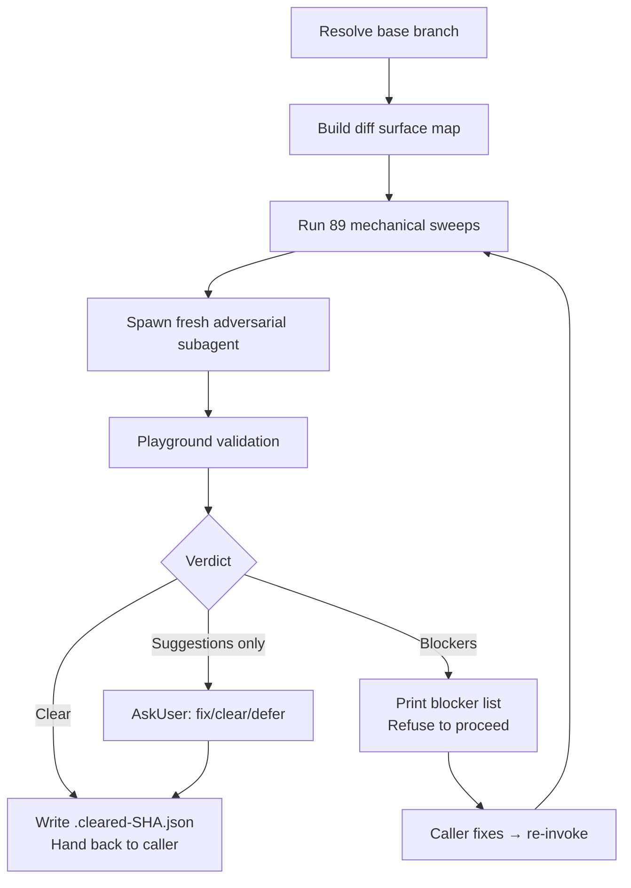

# wk-adversarial-review

> Adversarial pre-flight review of the current branch before anything leaves the machine.

**Version:** `2026.07.22-214113`

## Invocation

| Mode | Trigger |
|------|---------|
| User-invocable | `/wk-adversarial-review [base-branch]` |
| Model-invocable | automatic on: push, `gh pr ready`, new commits on existing PR, any force-push |

## How It Works

## Noteworthy

- **No opt-out exists.** "Small fix", "trivial", and "docs-only" are explicitly named red flags, not exemptions — even a docs commit can contradict test counts in a spec.
- **Idempotent within a session** — if no new commits land since the last clear verdict, re-invocation is a no-op that prints the prior clearance record (keyed by HEAD SHA).
- **89 mechanical sweeps run unconditionally** before any LLM reasoning (lower-frequency shape-specific sweeps live in `references/sweep-catalog-extended.md`, applied under the same rule), grouped into a compact sweep catalog that preserves security, sibling parity (incl. contract-transfer on copied directives), guard correctness, docs/spec sync (including routing claims vs authoritative reviewer statements and intra-doc struct-field-comment drift), contract widening, same-type-field sanitization symmetry, pipeline forwarding, cross-language stamped-binary contracts (`-ldflags -X`), LLM round-trip field-preservation, LLM-context-payload consumer-prompt sync, log-filter callsite parity, log/output parse and diagnostic-guard correctness (regex edge-case loss, proxy-discriminant branches), test quality (incl. bash-fake branch fall-through), and runtime-portability checks.
- **Fresh adversarial subagent** — the diff is piped directly, never hand-transcribed; the subagent stays coverage-aware, refactor-aware, relocation-aware, and introduction-claim-aware.
- **Playground validation is mandatory** for any runtime-behavior claim — findings that cannot be reproduced in `.review-playground/` are downgraded from `blocker` to `question`. The playground step owns the runtime matrix, mutation testing, the standalone upstream-source harness, specialized producer/consumer / cluster / interface-contract / allowlist checks, and read-based analysis for doc/prose/compression diffs (gate-survival-by-substance, count cross-checks, relocation portability).
- **Consumed as the investigation engine by [`wk-pr-review`](../pr-review/README.md)** — it delegates Phase 3 here and maps the returned findings into PR comments.
- **Fix loop caps at 3 cycles.** After 3 blocked rounds on the same axis, the skill surfaces to the user — repeated recurrence means the diagnosis or design is wrong, not just the fix.
- **This skill is a gate, not an actor.** It never pushes, never posts PR comments, never edits the PR — those actions belong to the calling skill ([`wk-pr`](../pr/README.md), [`wk-workflow`](../workflow/README.md), [`wk-pr-resolve`](../pr-resolve/README.md)).
