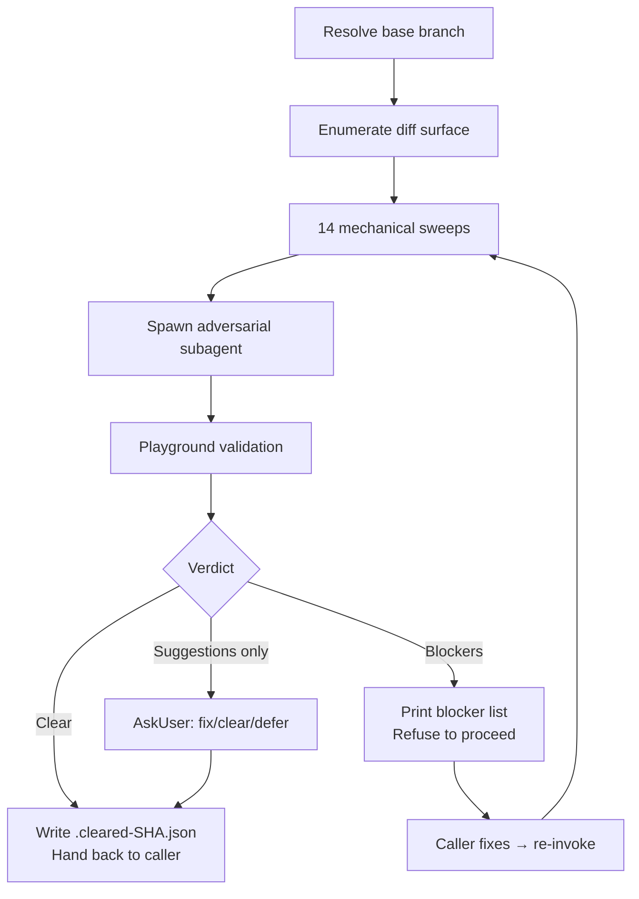

# wk-adversarial-review

> Adversarial pre-flight review of the current branch before anything leaves the machine.

**Version:** `2026.06.11-230337`

## Invocation

| Mode | Trigger |
|------|---------|
| User-invocable | `/wk-adversarial-review [base-branch]` |
| Model-invocable | automatic on: push, `gh pr ready`, new commits on existing PR, any force-push |

## How It Works

## Noteworthy

- **No opt-out exists.** "Small fix", "trivial", and "docs-only" are explicitly named red flags, not exemptions — even a docs commit can contradict test counts in a spec.
- **Idempotent within a session** — if no new commits land since the last clear verdict, re-invocation is a no-op that prints the prior clearance record (keyed by HEAD SHA).
- **14 mechanical sweeps run unconditionally** before any LLM reasoning: vulnerability-class, sibling-script, reachability, comment accuracy, hardcoded-base, version-pin, signature-widening, cross-doc enumeration, design-pivot, PR metadata sync, external-call reproduction, self-review surface, raw-API bypass, and pre-push gate compliance.
- **Playground validation is mandatory** for any runtime-behavior claim — findings that cannot be reproduced in `.review-playground/` are downgraded from `blocker` to `question`.
- **Fix loop caps at 3 cycles.** After 3 blocked rounds on the same axis, the skill surfaces to the user — repeated recurrence means the diagnosis or design is wrong, not just the fix.
- **This skill is a gate, not an actor.** It never pushes, never posts PR comments, never edits the PR — those actions belong to the calling skill ([`wk-pr`](../pr/README.md), [`wk-workflow`](../workflow/README.md), [`wk-pr-resolve`](../pr-resolve/README.md)).
