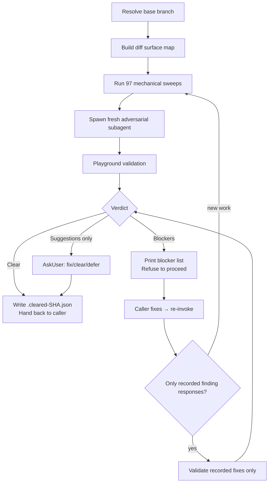

# wk-adversarial-review

> Adversarial review of the current branch before it merges — **exactly one run per change**, at the completion gate (plan executed, PR published and ready). Every other skill reads the recorded verdict instead of dispatching.

**Version:** `2026.07.30-220752`

## Invocation

| Mode | Trigger |
|------|---------|
| User-invocable | `/wk-adversarial-review [base-branch]` |
| Model-invocable | completion gate only; readers never dispatch |

## How It Works

## Noteworthy

- **No opt-out exists.** "Small fix", "trivial", and "docs-only" are explicitly named red flags, not exemptions — even a docs commit can contradict test counts in a spec.
- **Clearance follows reviewed work, not SHA equality** — tree-identical rewrites
  preserve the record. Finding-response commits get targeted validation; only
  unmatched scope, refactor, or logic triggers a delta-scoped review.
- **97 mechanical sweeps run unconditionally** before any LLM reasoning (lower-frequency shape-specific sweeps live in `references/sweep-catalog-extended.md`, applied under the same rule), grouped into a compact sweep catalog that preserves security, sibling parity (incl. contract-transfer on copied directives), guard correctness, docs/spec sync (including routing claims vs authoritative reviewer statements and intra-doc struct-field-comment drift), contract widening, same-type-field sanitization symmetry, pipeline forwarding, cross-language stamped-binary contracts (`-ldflags -X`), LLM round-trip field-preservation, LLM-context-payload consumer-prompt sync, log-filter callsite parity, log/output parse and diagnostic-guard correctness (regex edge-case loss, proxy-discriminant branches), test quality (incl. bash-fake branch fall-through and conditional skip-guards whose predicate never matches, silently deleting coverage while the suite reports green), gate exit-status contracts (a verifier whose raise routes to its caller’s non-blocking status, and a check that over-fires because it ignores the format’s documented inheritance), and runtime-portability checks.
- **One dispatch per change** — the completion gate owns the run;
  [`wk-pr-resolve`](../pr-resolve/README.md),
  [`wk-pr-review`](../pr-review/README.md),
  [`wk-pr-takeover`](../pr-takeover/README.md), and readers consume records.
  Fix rounds validate recorded findings without re-running sweeps or a subagent.
- **[`wk-pr-merge`](../pr-merge/README.md) is record-only** — missing clearance
  or genuinely new work returns to the completion gate; merge never dispatches.
- **Fresh adversarial subagent** — the diff is piped directly, never hand-transcribed; the subagent stays coverage-aware, refactor-aware, relocation-aware, and introduction-claim-aware.
- **Playground validation is mandatory** for any runtime-behavior claim — findings that cannot be reproduced in `.review-playground/` are downgraded from `blocker` to `question`. Every local run is scoped to the changed examples (never a suite or whole spec directory) — CI owns full-suite regressions, and mutation cycles inherit that scoping. The playground step owns the runtime matrix, mutation testing, the standalone upstream-source harness, specialized producer/consumer / cluster / interface-contract / allowlist checks, and read-based analysis for doc/prose/compression diffs (gate-survival-by-substance, count cross-checks, relocation portability).
- **Consumed as the investigation engine by [`wk-pr-review`](../pr-review/README.md)** — it delegates Phase 3 here and maps the returned findings into PR comments.
- **Targeted fix validation caps at 3 cycles.** After 3 blocked rounds, surface
  to the user; recurrence means diagnosis or design is wrong.
- **This skill is a gate, not an actor.** It never pushes, never posts PR comments, never edits the PR — those actions belong to the calling skill ([`wk-pr`](../pr/README.md), [`wk-workflow`](../workflow/README.md), [`wk-pr-resolve`](../pr-resolve/README.md)).
