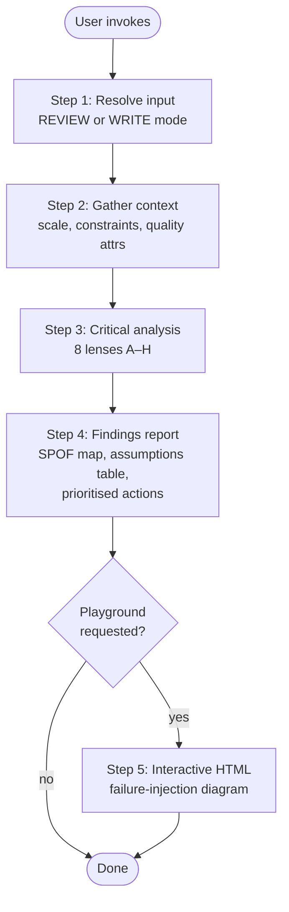

# wk-arch-review

Expert-level critical review of software architecture documents, specs,
implementation plans, and delivery estimates. Surfaces SPOFs, unhappy paths,
and underlying assumptions. Can also author architecture documents and generate
interactive HTML playgrounds that visualise a proposed design and its failure
modes.

**Version:** `2026.07.17-164707`

## Trigger

- Reviewing an architecture doc, RFC, spec, or ADR
- Authoring a new architecture document or implementation plan
- Reviewing a delivery estimate for feasibility and risk
- Wanting a visual, interactive summary of a proposed architecture
- Phrases: "review this arch", "review this spec", "critique this design",
  "what are the failure modes", "write an arch doc for",
  "architecture playground"

## Key Phases

## Analysis Lenses

Eight lenses applied in Step 3 — each must be addressed even if the
finding is "none observed":

| Lens | Focus |
|------|-------|
| A — SPOF | Components whose failure cascades beyond expected blast radius |
| B — Unhappy paths | Timeouts, queue overflow, split deploys, migration failures |
| C — Assumptions | Explicit, implicit, verified vs. unverified |
| D — Scalability | Bottlenecks at 10×/100× load, hot partitions, O(n²) |
| E — Security | Trust boundaries, data exposure, SSRF/injection risk |
| F — Operability | Observability, graceful degradation, rollback |
| G — Cost | Over-provisioning, cross-region transfer, no cost ceiling |
| H — Delivery risk | External dependencies, unproven tech, missing milestones |

## Output Shape

- **Findings report:** severity-rated (🔴🟠🟡🟢), each with problem, failure
  mode, concrete recommendation, and effort estimate.
- **SPOF map:** every single point of failure with its blast radius.
- **Assumptions table:** each assumption with verified/unverified/risky status.
- **Prioritised actions:** ordered by risk-reduction × effort.
- **Playground (optional):** self-contained HTML with interactive failure
  injection and gotcha callouts.

## Model

`opus` — deep reasoning required; adversarial by design.

## Reference Templates

Bundled under `references/`, read by the skill at runtime:

- `review-lenses.md` — exhaustive probe checklist for all 8 lenses.
- `findings-report-template.md` — the findings-report skeleton.
- `playground-template.html` — self-contained, dependency-free interactive
  playground (failure injection, blast-radius sidebar, gotchas panel).

## Noteworthy

- Step 3 output is findings only — no paraphrasing or praise padding
  (except a short "What the Design Gets Right" section for credibility).
- Playground is self-contained and dependency-free; works offline.
- "Out of scope" sections in the input doc are explicitly reviewed —
  they often contain the riskiest deferred decisions.
- Auto-invoked by [`wk-pr-review`](../pr-review/README.md) when a diff changes
  architecture/spec/design docs or fundamentally alters the project's
  architecture.
- Related: [`wk-adversarial-review`](../adversarial-review/README.md) (pre-push
  adversarial check).
