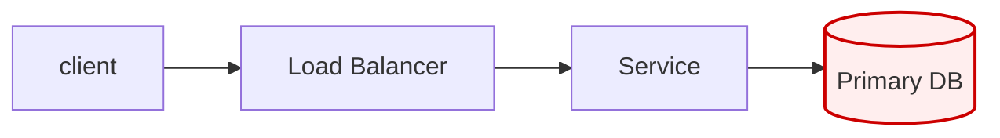

# Architecture Review: <System Name>

**Reviewer role:** Distinguished Engineer / Principal Architect
**Date:** <YYYY-MM-DD>
**Document reviewed:** <path / URL / title @ revision>

---

## Context Block

- **Scale:** <users, RPS/QPS, data volume, growth, regions>
- **Top quality attributes (ranked):** 1. <…> 2. <…> 3. <…>
- **Environment:** <cloud / on-prem / edge / hybrid>
- **Hard constraints:** <regulatory, budget, team, mandated tech>
- **Timeline:** <delivery target>

## Executive Summary

<3–5 sentences. Overall verdict and the single biggest risk. Written for a
director who reads nothing else.>

## Critical Findings

> Severity: 🔴 Critical · 🟠 High · 🟡 Medium · 🟢 Low · ℹ️ Info

#### [🔴 Critical] <finding title>

- **Lens:** <A–H>
- **Where:** <section / line / component>
- **Problem:** <one precise paragraph — what is wrong and why it matters>
- **Failure mode:** <what breaks, when it fires, customer-visible impact>
- **Recommendation:** <concrete change; name the pattern/tech — "Do X because Y">
- **Effort:** <Hours | Days | Weeks> — <one-line rationale>

#### [🟠 High] <finding title>

- **Lens:** …
- **Where:** …
- **Problem:** …
- **Failure mode:** …
- **Recommendation:** …
- **Effort:** …

<repeat, severity-ordered>

## Underlying Assumptions

| Assumption | Status | Risk if wrong |
|------------|--------|---------------|
| <assumption> | Verified / Unverified / Risky | <impact> |

## SPOF Map

- **<component>** — blast radius: <what goes down with it> · mitigation: <…>
- **<component>** — blast radius: <…> · mitigation: <…>

<optional mermaid:>

## Prioritised Actions

> Ordered by risk-reduction ÷ effort — cheapest high-impact fixes first.

1. <action> — addresses <finding(s)> — effort <…>
2. <action> — …
3. <action> — …

## What the Design Gets Right

<short, honest acknowledgement of sound choices — establishes that the review is
balanced, not reflexively hostile>
