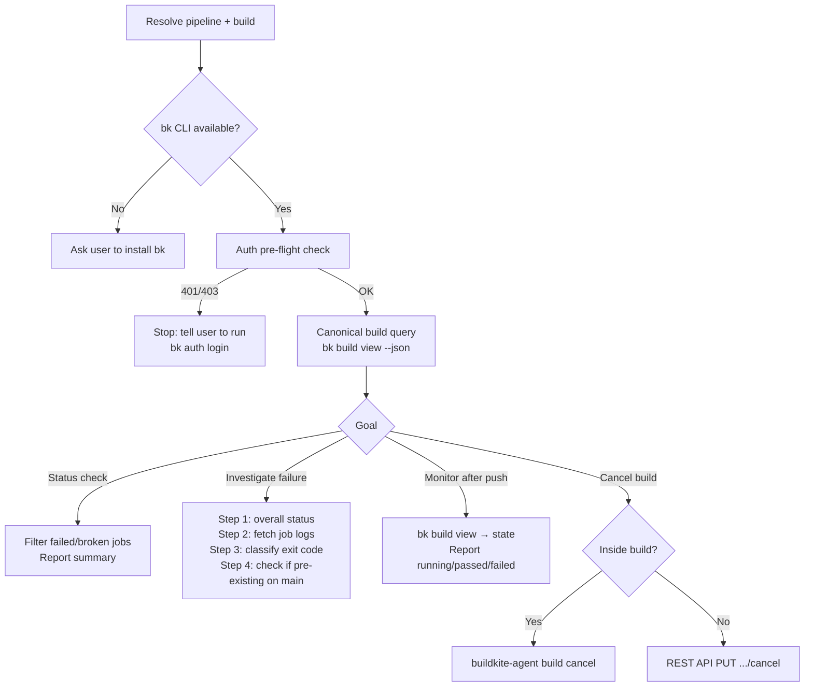

# wk-buildkite

> Use when working with Buildkite CI — checking build status, investigating failures, viewing job logs, or monitoring builds after push.

**Version:** `2026.06.25-214432`

## Invocation

| Mode | Trigger |
|------|---------|
| User-invocable | "check CI", "build status", "why did CI fail", Buildkite URL shared |
| Model-invocable | automatic on: CI failure investigation, build monitoring after push, any CI status query |

## How It Works

## Noteworthy

- **`broken` jobs are almost never the root cause** — `broken` usually means skipped due to upstream failure or conditional logic. Always investigate `failed` jobs first.
- **Never use `WebFetch` on a Buildkite URL** — the HTML view omits structured job data. Always use `bk build view --json` with `jq`.
- **Cross-step status must use `buildkite-agent step get "outcome"`**, not sentinel files or artifact presence — if a step crashes before its cleanup trap runs, file-based signals are never written.
- **Auth failures are a hard stop** — never extract tokens to call the REST API via `curl` as a workaround; token-based curl bypasses scope checks and leaks credentials into shell history.
- **Env vars must be forwarded at every layer** (pipeline YAML → build script → docker-compose → Dockerfile `ENV`) or they are silently dropped before reaching the container.
- **Artifact downloads use a namespaced path** `/tmp/agent/buildkite/<build>/<job_id>/...` to prevent cross-session overwrites and provide a greppable audit trail.
- **Never foreground-poll** — an `until`/`while` loop on `bk build view` blocks the turn for minutes; run a single status check, or watch with `run_in_background: true`.
- **A monitoring announcement carries URL + failing step + next action** — never just "monitoring in background"; the user must be able to tell whether the failure is already identified. Non-required checks (security scanners, dep bots) never gate a merge — gate only on GitHub `required == true` checks (pr-merge Step 2 owns this).
