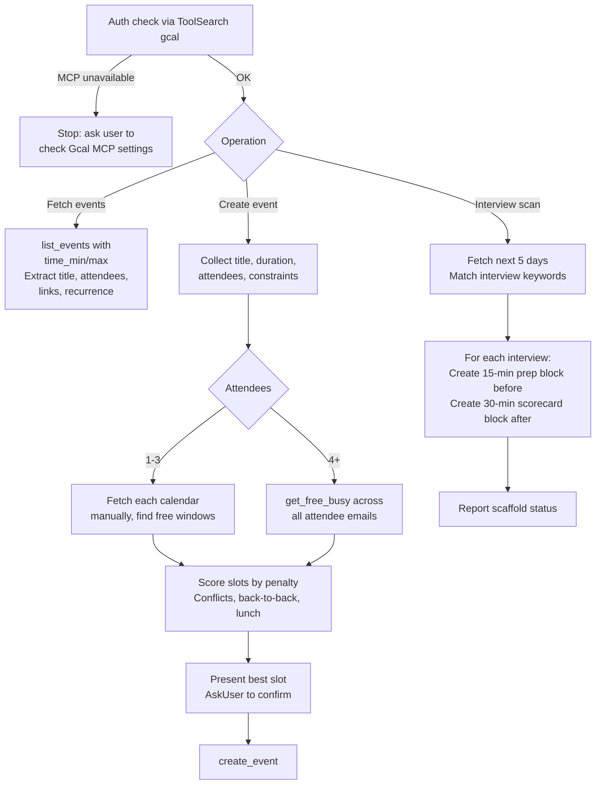

# wk-cal

> Use for all Google Calendar operations — fetching events, creating events in smart free slots, checking availability, and scanning for upcoming interviews.

## Invocation

| Mode | Trigger |
|------|---------|
| User-invocable | "schedule a meeting", "check my calendar", "find time for X", "do I have interviews" |
| Model-invocable | automatic on: `wk-goodmorning` (interview prep scan), `wk-goodevening` (tomorrow preview) |

## How It Works

## Noteworthy

- **MCP auth is a hard gate** — if `ToolSearch("gcal")` returns no tools, the skill stops immediately; no fallback to manual date math or placeholder data.
- **Working hours are 9am–6pm** in the user's local timezone; lunch (12–1pm) is soft-protected with a scheduling penalty, never a hard block.
- **Debrief interviews skip the scorecard block** — debrief sessions are already the scorecard discussion, so only the 15-min prep block is created.
- **Slot ranking uses a penalty system** — conflicts add +3 per attendee, back-to-back adds +1, lunch window adds +2; lowest penalty wins with earlier-in-day as tiebreaker.
- **All calendar-touching skills delegate here** — `wk-goodmorning` and `wk-goodevening` call this skill rather than calling the Gcal MCP directly.
- **Scorecard blocks scan forward in 30-min increments** if the immediate post-interview slot is busy; if no same-day slot exists, it flags to the user rather than silently skipping.
