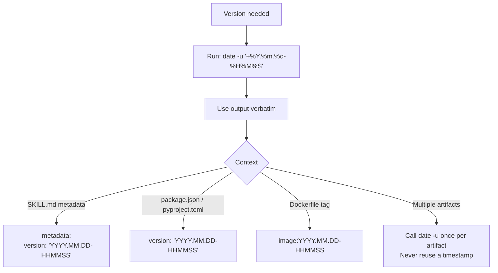

# wk-calver

> Generate a CalVer version string in YYYY.MM.DD-HHMMSS format using UTC time.

## Invocation

| Mode | Trigger |
|------|---------|
| User-invocable | `/wk-calver [context label]` |
| Model-invocable | automatic on: any version assignment — skill metadata, `package.json`, Dockerfile tags, config files, release artifacts |

## How It Works

## Noteworthy

- **Semver is forbidden** when this skill is active — `1.0.0`, `2.3.1`, or any `MAJOR.MINOR.PATCH` form must not be produced or suggested.
- **Always UTC** — `date` without `-u` is wrong; local machine time produces non-reproducible version strings across timezones.
- **Never reuse a timestamp** — if two artifacts need versioning in the same session, call `date -u` twice and use each output once.
- **The only tool needed is `Bash(date:*)`** — this skill is intentionally minimal; no file reads, no git queries, no network calls.
- **Applies to everything version-shaped** — not just skill `metadata.version` but any context where a human might reach for semver: `package.json`, `pyproject.toml`, Dockerfile image tags, release artifact names.
