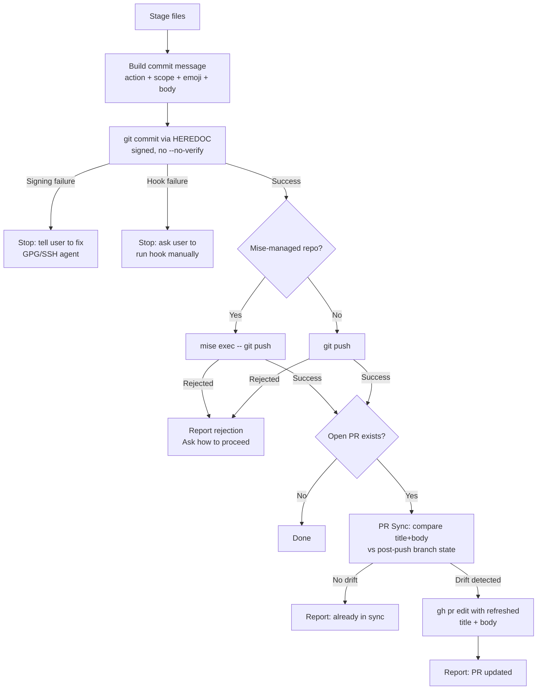

# wk-commit

> Use when creating git commits or pushing code. Enforces conventional commits with emoji, commit signing, and safe push behavior.

**Version:** `2026.07.31-023847`

## Invocation

| Mode | Trigger |
|------|---------|
| User-invocable | "commit this", "push", `/wk-commit` |
| Model-invocable | automatic on: any git commit or push operation |

## How It Works

## Noteworthy

- **Push is part of the commit sequence**, not a separate step — every commit is followed by a push unless the user has explicitly said not to. Silent skip is a violation. Exception: the first push of a brand-new branch with no open PR is gated on user confirmation, to avoid orphaned remote branches — unless auto mode is on and the originating directive already authorizes a tracked PR, in which case it pushes without re-confirming.
- **Exactly one emoji per commit subject** — classifiers beat primary action emojis (`📌` beats `🔧` for a pin), and `🤖` is the canonical fallback for agent-authored or mixed-bag commits rather than stacking multiple emojis.
- **PR Sync runs after every successful push** to a branch with an open PR — title and body are diffed against the post-push state and updated if they have drifted, with human-authored sections (review checkboxes, hand-edited test plans) preserved.
- **Signing is non-negotiable** — `--no-gpg-sign`, `-n`, and `git -c commit.gpgsign=false` are forbidden. For
  linked/temporary worktrees, probe signing config from the exact shell that will run `git -C`; launch cwd does not
  carry config. Only a completed signed commit with a raw `gpgsig` header proves success.
- **`mise exec --` is required before push** in mise-managed repos — without it, git hooks (lefthook, husky) fail with exit 127 for tools like `lychee` and `shellcheck`. Never `eval "$(mise activate bash)"`; the supported single-command form is `mise exec --`.
- **Post-CI squash offer** fires when ≥3 `fix(ci):` commits exist with a net diff under 50 lines — never auto-squashes, always asks, and requires explicit user approval for the mandatory force-push. A single trivial follow-up correcting the immediately prior commit gets an explicit `--amend` approval prompt at the fix site (auto mode blocks `--amend`), not silent accumulation.
