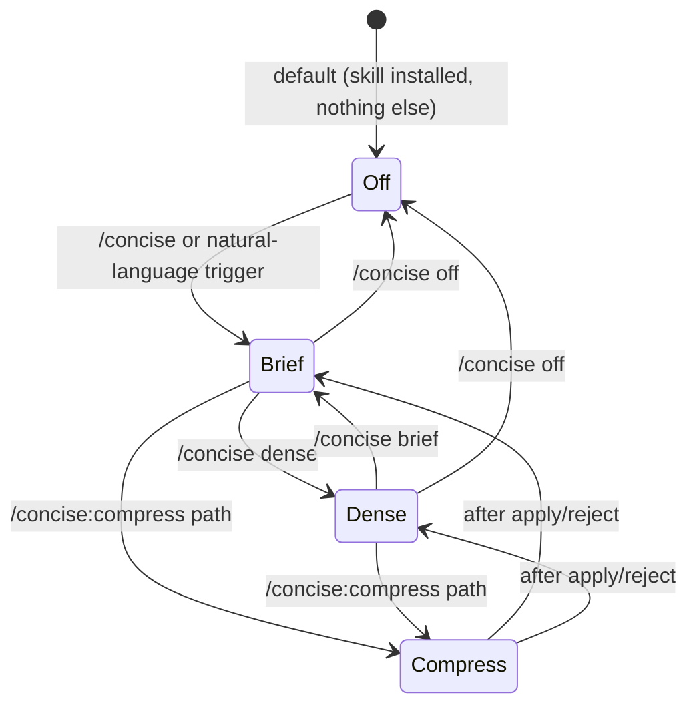

# wk-concise

> Reduce response verbosity and token usage while preserving technical accuracy.

**Version:** `2026.07.28-171036`

## Invocation

| Mode | Trigger |
|------|---------|
| User-invocable | `/concise`, `/concise brief`, `/concise dense`, `/concise off`, `/concise:compress <path>` |
| Model-invocable | automatic on: "be brief", "less words", "reduce tokens", "shorter responses", "compress context" |

## How It Works

## Noteworthy

- **Three hard caps in brief mode**: ≤3 sentences per answer (excluding code/diffs/safety warnings), no tables for ≤3 items, no section headers for single-section answers — enforced per-turn by the `concise-reminder.sh` hook.
- **Six categories that are never compressed** regardless of mode: code blocks, security warnings, irreversible-action confirmations, technical terms/paths/URLs, exact error messages, and clarification threads (resume only after a new unrelated task).
- **Self-installing on first invocation** — detects whether the `settings.json` hook and `CLAUDE.md` snippet are installed, offers to wire them up automatically (one-time, gated by `$HOME/.claude/.concise-setup-offered`).
- **Mode persists via `$HOME/.claude/.concise-mode`** file — the hook reads it on every turn; `$CONCISE_OFF=1` and `$HOME/.claude/.concise-off` take precedence as opt-out signals.
- **`/concise:compress` refuses dangerous targets** — files with >50% code content, credential/secret files (`*.pem`, `.env*`, `*password*`), and paths under `.ssh/`, `.aws/`, `.kube/`, `.gnupg/`, `.config/gcloud/`, `.docker/`.
- **Dense mode adds fragment syntax and causality arrows** (`X → Y`) on top of brief mode's filler removal; brief preserves full sentences and articles.
