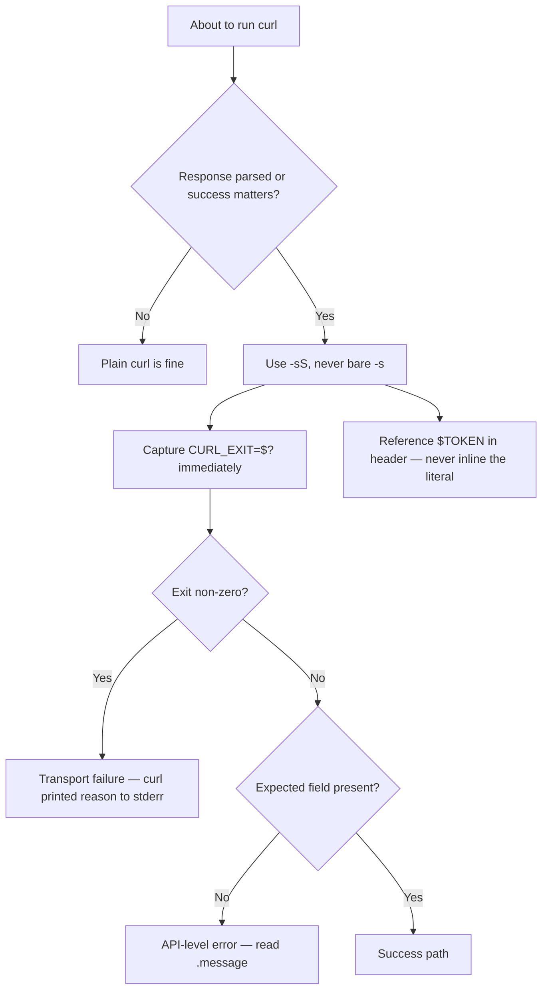

# wk-curl

> Use whenever invoking curl to call an HTTP/HTTPS endpoint whose response is parsed or whose success matters — enforces transport-error-safe flags, exit-status capture, and token hygiene.

## Invocation

| Mode | Trigger |
|------|---------|
| User-invocable | `/wk-curl` |
| Model-invocable | automatic on: any `curl` command whose response is parsed or whose success matters |

## How It Works

## Noteworthy

- **HARD RULE — `-sS` not bare `-s`:** `-s` suppresses curl's own transport-error diagnostic, so a DNS/TLS/connection failure yields empty stdout and a misleading parse error. `-sS` keeps the error on stderr.
- **HARD RULE — capture the exit status:** a failed connection exits non-zero with empty stdout; branch on `$?` before parsing the body so transport failures aren't misreported as API errors.
- **HARD RULE — secrets off the command line:** an inline token is visible in `ps` and shell history; reference `$TOKEN` inside the quoted header instead.
- **Status-code split:** use `curl -sS -o body.txt -w '%{http_code}'` to separate the HTTP status from the body.
