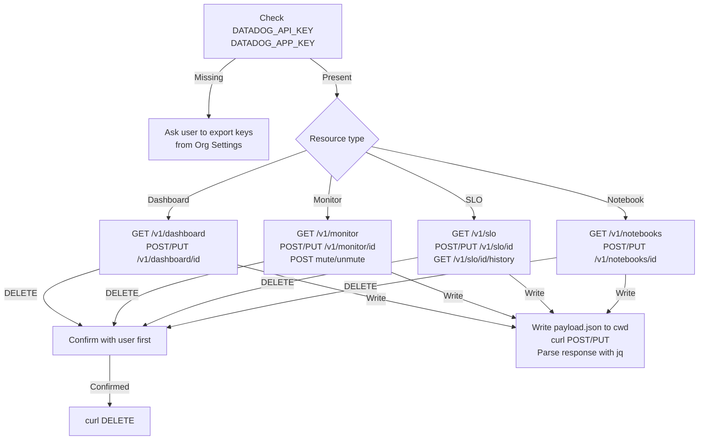

# wk-datadog

> Create, manage, and edit Datadog dashboards, monitors, SLOs, and notebooks via the Datadog REST API.

**Version:** `2026.06.15-195921`

## Invocation

| Mode | Trigger |
|------|---------|
| User-invocable | "create a dashboard", "set up a monitor", "define an SLO", "create a notebook", "delete monitor X" |
| Model-invocable | automatic on: any Datadog resource management request |

## How It Works

## Noteworthy

- **`DATADOG_SITE` defaults to `datadoghq.com`** — override for EU (`datadoghq.eu`), US3 (`us3.datadoghq.com`), US5 (`us5.datadoghq.com`), or AP1 (`ap1.datadoghq.com`) orgs.
- **Write tool is restricted to temporary JSON payload files** in the current directory only — never writes to project source, config, or other paths.
- **Confirm-before-delete is a hard rule** for every resource type; there is no bulk-delete shortcut and no silent deletion.
- **Clone pattern**: GET the dashboard, strip the `id` field, modify the title, then POST — no dedicated clone endpoint exists in v1.
- **Rate limit handling**: on HTTP 429, read the `X-RateLimit-Reset` header and wait before retrying — do not retry immediately.
- **All requests share a single auth header array** (`DD-API-KEY` + `DD-APPLICATION-KEY` + `Content-Type: application/json`) built once and reused across all curl calls in a session.
