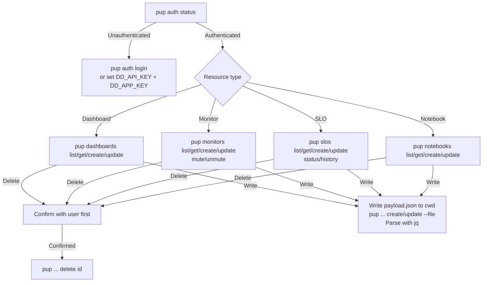

# wk-datadog

> Create, manage, and edit Datadog dashboards, monitors, SLOs, and notebooks via the `pup` CLI.

**Version:** `2026.07.17-202044`

## Invocation

| Mode | Trigger |
|------|---------|
| User-invocable | "create a dashboard", "set up a monitor", "define an SLO", "create a notebook", "delete monitor X" |
| Model-invocable | automatic on: any Datadog resource management request |

## How It Works

## Noteworthy

- **`pup` is the interface** — Datadog's agent-ready CLI, preferred over raw REST/curl and over the Datadog MCP server. `pup api <METHOD> <path>` is the escape hatch for anything without a dedicated subcommand.
- **`--no-agent` on handed-off commands** — agent mode wraps output in a `{status, data, metadata}` envelope; append `--no-agent` to any command written into a script/alias/runbook so the user's output shape matches.
- **`DD_SITE` defaults to `datadoghq.com`** — override for EU (`datadoghq.eu`), US3/US5, or AP1 orgs, or pass `--site`.
- **Write tool is restricted to temporary JSON payload files** in the current directory only — never project source, config, or other paths.
- **Confirm-before-delete is a hard rule** for every resource type; never pass `--yes` to a delete without explicit user confirmation.
- **Resolve resource-type intent first** — "create X per Y" splits into one filterable dashboard (template variables) vs. a new resource per instance; ask before building.
- **Widget custom links** — `{{@attr.value}}` for external URLs, `{{@attr}}` for Datadog search URLs; mixing them breaks links.
