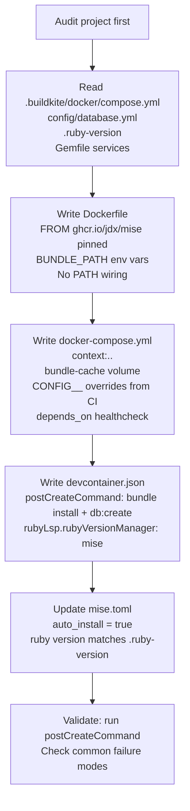

# wk-devcontainer

> Use when creating or debugging a devcontainer for a Rails app (or any mise-managed project).

**Version:** `2026.08.18-203656`

## Invocation

| Mode | Trigger |
|------|---------|
| User-invocable | "set up devcontainer", "create devcontainer", "devcontainer not working", "bundle install fails in devcontainer", "mise tools missing in container" |
| Model-invocable | automatic on: devcontainer creation or debugging requests for mise-managed projects |

## How It Works

## Noteworthy

- **Check `.buildkite/docker/compose.yml` first** — it is the authoritative source for `CONFIG__` env var keys, service image versions, and SSL mode settings; copy them, don't guess.
- **Never add `ENV PATH=.../shims` or `eval "$(mise activate bash)"` to the Dockerfile** — the `jdx/mise` image already configures both; manual additions cause double-activation bugs.
- **Never `COPY mise.toml` or `RUN mise install` in the Dockerfile** — use `auto_install = true` in `mise.toml` instead; tools install on first container start when the workspace bind-mounts.
- **`BUNDLE_PATH` and `BUNDLE_APP_CONFIG` must both be set** in the Dockerfile to `/usr/local/bundle`; without them the named `bundle-cache` volume is bypassed and gems reinstall on every restart.
- **`trilogy` adapter does not need `libmysqlclient-dev`** — only the `mysql2` adapter links against libmysqlclient; adding it for trilogy is a common unnecessary dependency.
- **`MISE_TRUSTED_CONFIG_PATHS: /workspace` is required** in the compose environment — the bind mount replaces the `/workspace` directory that was trusted at image build time, so trust must be re-granted at runtime.
- **Pin the Compose project name in every teardown/rebuild command** — `devcontainer up`/VS Code create the stack under `<basename>_devcontainer`; a bare `docker compose -f … down` targets an empty project and silently leaves it running.
- **Do not stream startup output when Compose resolves host credentials** — prefer file-backed secrets; otherwise capture under `umask 077`, print only an exact-value-redacted copy, and verify with a canary.
