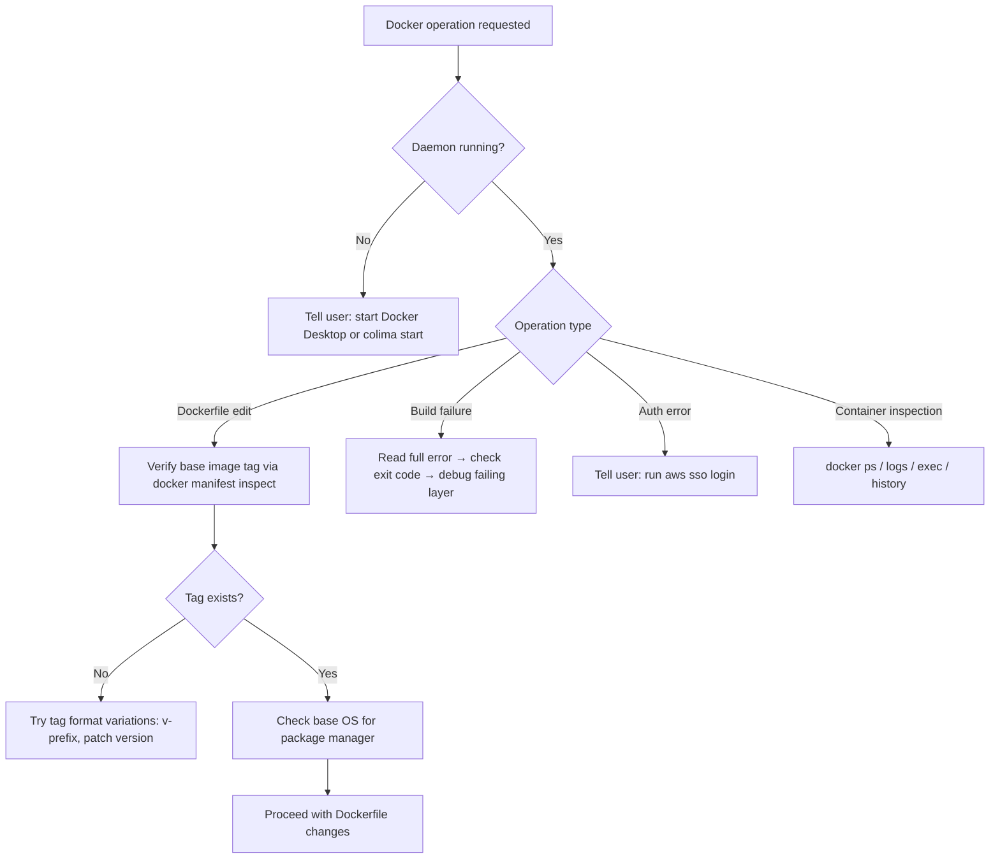

# wk-docker

> Use when working with Docker — building images, inspecting containers, debugging Dockerfile issues, verifying image tags exist, or troubleshooting Docker daemon connectivity.

**Version:** `2026.08.13-090314`

## Invocation

| Mode | Trigger |
|------|---------|
| User-invocable | `/wk-docker` |
| Model-invocable | automatic on: Docker-related errors, Dockerfile edits, docker-compose operations, image tag verification needs |

## How It Works

## Noteworthy

- **A registry 401 is not a hard stop:** When a provisioning script cannot install dependencies because the package registry rejects an expired credential, the skill seeds the target volume from a sibling container's volume on the same daemon (throwaway container mounting both, `cp -a`) and installs offline — guarded on matching lockfile generation and on confirming both project-prefixed volume names first, since a mistyped destination silently creates an empty volume and copies into nothing.

- **HARD RULE:** Always run `docker manifest inspect <image>:<tag>` before using any image tag in a `FROM` directive — never assume a tag exists.
- **ENTRYPOINT reset:** Images with custom entrypoints break `docker-compose run` commands; the fix is `ENTRYPOINT []` in the Dockerfile. Verify with `docker run --rm <image> sh -c 'echo works'`.
- **Runtime env vars contract:** Every env var read by the entrypoint at runtime must have an `ENV VAR=""` declaration in the Dockerfile — the image is the canonical interface document.
- **Env-forwarding audit:** Compose / the `docker_compose` plugin forward only vars listed in `environment:` / `env:`. Audit the full container runtime call-graph reads against that list (not just the diff delta) and cross-check siblings; a missing entry is a silent runtime no-op. Never proxy a target-artifact SHA with a host build SHA.
- **Git worktree breaks git in containers:** A worktree's `.git` is a *file* pointing at a host absolute path that dangles inside the container → `git rev-parse` fails and git-aware tooling aborts. Materialize a standalone repo (`rm .git`, `git init && add && commit`) and mount that, never the live worktree.
- **`docker` missing on PATH (macOS):** A dropped Homebrew symlink → run `brew link docker` and prepend `/opt/homebrew/bin` to PATH before retrying.
- **Daemon startup is user-only:** The skill never attempts to start the Docker daemon itself; it instructs the user to start Docker Desktop or `colima start`.
- **ECR auth:** `authorization failed` / `ExpiredToken` errors always mean `aws sso login` — the skill does not attempt re-authentication.
- **Exit code table:** Codes 137 (OOM) and 125 (daemon error) have specific meanings; the skill maps them rather than treating all failures as generic errors.
- **Bind-mount overlay:** A CI step running under `-v checkout:/workdir --workdir=/workdir` shadows the image at the mount point — `COPY` to that path is invisible. Generated artifacts must come from the step command (e.g. `go generate`), not a Dockerfile `COPY`.
- **Multi-worktree port conflicts:** When a sibling worktree's devcontainer holds the default port, skip `docker compose up` and use `docker run --network=<project-network>` with named volumes (no `-p`) to get a working shell without stopping the sibling's stack.
- **Hand-started container credentials:** Before debugging private-registry auth in a manually started container, grep the project's setup script for credential env var export format — package managers use tool-specific naming, not generic API key vars.
- **dind network failures → check floating tags first:** A `RUN` failing on a network/fetch error inside docker-in-docker usually means a floating `FROM` tag updated and invalidated the layer cache, forcing a cold run with no bridge network. Pin the tag to the project's tool-version file before reaching for `--network=host`.
