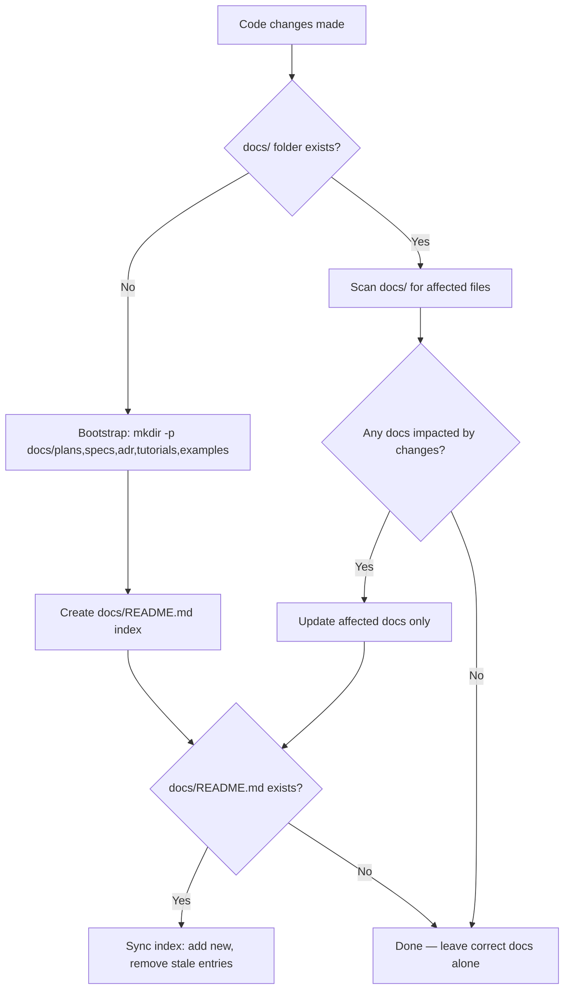

# wk-docs

> Check for and update documentation affected by code changes. Bootstraps a docs structure if the project doesn't have one.

## Invocation

| Mode | Trigger |
|------|---------|
| User-invocable | `/wk-docs` |
| Model-invocable | automatic on: code changes, new features, API modifications, potentially stale docs |

## How It Works

## Noteworthy

- **HARD RULE:** Write and Edit tools may only target files under the docs root (`docs/`, `documentation/`, `doc/`, or `site/`). The skill never writes outside the docs directory.
- **Surgical updates:** Only docs made inaccurate by the current changes are touched — the skill never reformats or rewrites docs that are still correct.
- **Docs root discovery:** The skill checks for `docs/`, `documentation/`, `doc/`, and `site/` in that order; it uses whichever exists rather than assuming `docs/`.
- **Bootstrap is non-destructive:** If the project has no docs folder, the skill creates the canonical structure; it never overwrites an existing layout.
- **Index maintenance:** `docs/README.md` is kept in sync — new docs are listed, stale entries removed — so the index is always a reliable map of what exists.
- **Read-only code access:** Grep, Glob, and Read may access any path to understand code changes; only writes are restricted to the docs root.
