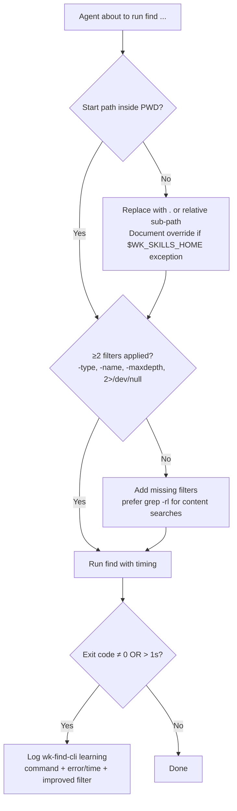

# wk-find-cli

> Auto-invoked before any `find` CLI call — enforces PWD scope, targeted filters, and captures slow/failing invocations as learnings.

**Version:** `2026.06.11-215001`

## Invocation

| Mode | Trigger |
|------|---------|
| Model-invocable | Automatic — fires before every `find` command the agent emits |

## How It Works

## Noteworthy

- **PWD-only rule**: `find /`, `find ~`, or `find ..` are forbidden — replace with `.` or a relative sub-path. The sole exception is `$WK_SKILLS_HOME` queries in skill plumbing, which must be documented.
- **Two-filter minimum**: every call needs ≥2 of `-type`, `-name`, `-maxdepth`, `2>/dev/null` — unfocused tree walks are the biggest source of slow `find` calls.
- **Prefer alternatives**: `grep -rl` for content searches, `ls` or Glob for flat listings — both are faster than the equivalent `find` for known-shallow targets.
- **Self-improving**: when a call fails or takes > 1 second, a [wk-learn](../learn/README.md) capture fires automatically — the next run benefits from the improved filter.
