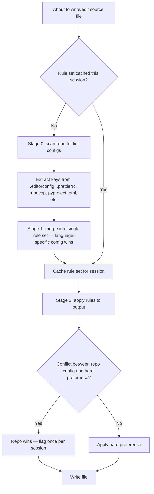

# wk-format

> Apply the user's code-formatting preferences to any file the agent writes or edits, reconciled with the repo's existing lint/style configs. Repo lint config is authoritative — preferences fill gaps, never override.

## Invocation

| Mode | Trigger |
|------|---------|
| User-invocable | `/wk-format` (rescan), `/wk-format rules` (print active set), `/wk-format check <path>` (lint file) |
| Model-invocable | automatic on: any write or edit to a source file |

## How It Works

## Noteworthy

- **Repo config is authoritative:** `.prettierrc`, `rubocop.yml`, `pyproject.toml [tool.black]`, etc. always override user preferences on conflict. The conflict is surfaced once per session, not on every edit.
- **Hard preferences (gaps only):** 2-space indent, ≤120 columns, trailing newline, no multi-line ternaries, functions ≤40 lines, no vague names (`data`, `temp`, `result`, etc.), no input-parameter reassignment.
- **Rule set is cached per session per repo:** Stage 0 runs once; subsequent edits reuse the cached set for speed.
- **Documentation is mandatory:** Every new function gets a docstring/JSDoc/rustdoc block naming contract, params, return, errors, and side effects — this preference is never overridden by repo config.
- **Greenfield repos** (no lint config found) get the hard preferences applied as defaults, with a note in the first commit.
- **`/wk-format check <path>`** reports violations with line numbers without modifying the file — useful for auditing existing code before a PR.
