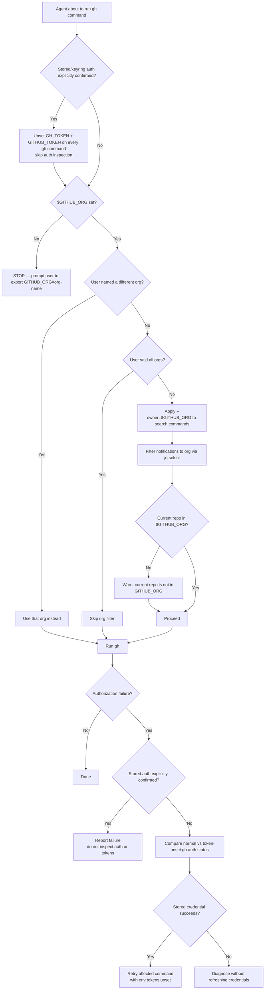

# wk-gh

> Ensures all `gh` CLI and GitHub interactions are scoped to the user's organization via `$GITHUB_ORG`.

**Version:** `2026.08.05-211540`

## Invocation

| Mode | Trigger |
|------|---------|
| User-invocable | Not user-invocable |
| Model-invocable | automatic on: any `gh` CLI command, GitHub PR/issue/notification interaction |

## How It Works

## Noteworthy

- **Hard stop on missing var:** The skill never guesses the org from the current repo URL — if `$GITHUB_ORG` is
  unset, all `gh` operations halt and the user is prompted to set it explicitly.
- **Exceptions are explicit:** The org filter is bypassed only when the user names a different org, says "all orgs",
  or the command targets the current repo directly (e.g., `gh pr view`).
- **Artifact download path:** Files saved from `gh` commands go to
  `/tmp/agent/gh/<owner>/<repo>/<resource_type>/<resource_id>/<filename>` — mirrors the Buildkite convention.
- **Notification filtering uses `jq`:** Org-scoping for `gh api notifications` is applied via
  `.repository.owner.login == "$GITHUB_ORG"` in a jq filter, not a CLI flag.
- **Variable-dependent projections use standalone `jq`:** `gh --jq` accepts one expression, so bind shell values by
  piping raw `--json` output to `jq --arg` or `jq --argjson`.
- **Environment tokens shadow stored credentials:** After explicit stored/keyring confirmation, every `gh` command
  removes `GH_TOKEN` and `GITHUB_TOKEN` at the command boundary and skips auth inspection. Without confirmation, an
  unexpected authorization failure is diagnosed by comparing normal and token-unset status before any refresh.
- **Point-in-time footer link:** The canonical outbound footer's
  [wk-skills](https://github.com/whizzzkid/skills) link pins to `tree/main@%7B<UTC>%7D` — a render-time UTC
  timestamp — so readers see the skills as they were when the message posted, not moving HEAD.
- **PR-body footer placement is server-verified:** after create/edit, re-fetch the returned body and rerun the footer
  gate; generated reference metadata is preserved before the final footer, with one bounded corrective resubmission.
- **Rollup union rules sit in their own section:** `Reading statusCheckRollup` is placed ahead of the `--watch`
  guidance and applies to every consumer — the watch subcommand, a hand-rolled `until` poll, or a one-shot readiness
  check. CheckRun nodes carry `.status`/`.conclusion`; commit Status nodes carry `.state` with `.status == null`, so a
  filter over one field alone reports green while a pending status context is still building.
- **Rollup granularity:** `statusCheckRollup` has one entry per registered check, not per pipeline job — it answers
  "is the pipeline green", never "did that specific job pass"; a per-job claim must cite the CI provider's per-job
  view and exit status.
- **Superseded same-head runs:** A cancelled GitHub Actions check waits when a newer run of the same workflow and
  HEAD is live; the newest matching run's terminal conclusion owns the gate.
- **Run event is part of the gate:** Verify the trigger and run for the current ref. A successful
  `workflow_dispatch` run proves commit execution only; PR readiness still requires the live rollup and merge state.
  PRs created or updated with the repository `GITHUB_TOKEN` can have PR-context runs awaiting explicit approval;
  unattended creation uses a GitHub App installation token or personal access token.
- **Green visible checks can still omit a required context:** when merge state is
  blocked, compare ruleset requirements against the current HEAD rollup; an
  absent context is a blocker without a failure.
- **Stack metadata is not a gate SHA:** use `gh stack view --json` for topology
  and membership, then resolve each pull request's live `headRefOid` with
  `gh pr view` before CI or merge gating.
- **Model-invocable only:** This skill is a guard rail, not a user command — it fires silently alongside any other
  skill that uses `gh`.
