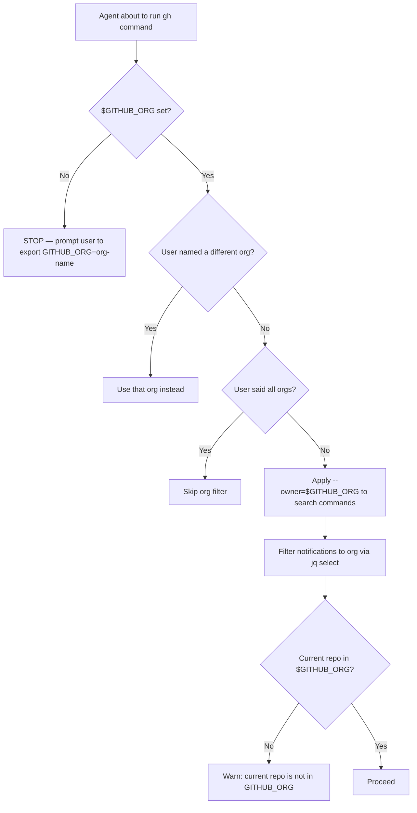

# wk-gh

> Ensures all `gh` CLI and GitHub interactions are scoped to the user's organization via `$GITHUB_ORG`.

**Version:** `2026.07.14-213439`

## Invocation

| Mode | Trigger |
|------|---------|
| User-invocable | Not user-invocable |
| Model-invocable | automatic on: any `gh` CLI command, GitHub PR/issue/notification interaction |

## How It Works

## Noteworthy

- **Hard stop on missing var:** The skill never guesses the org from the current repo URL — if `$GITHUB_ORG` is unset, all `gh` operations halt and the user is prompted to set it explicitly.
- **Exceptions are explicit:** The org filter is bypassed only when the user names a different org, says "all orgs", or the command targets the current repo directly (e.g., `gh pr view`).
- **Artifact download path:** Files saved from `gh` commands go to `/tmp/agent/gh/<owner>/<repo>/<resource_type>/<resource_id>/<filename>` — mirrors the Buildkite convention.
- **Notification filtering uses `jq`:** Org-scoping for `gh api notifications` is applied via `.repository.owner.login == "$GITHUB_ORG"` in a jq filter, not a CLI flag.
- **Model-invocable only:** This skill is a guard rail, not a user command — it fires silently alongside any other skill that uses `gh`.
