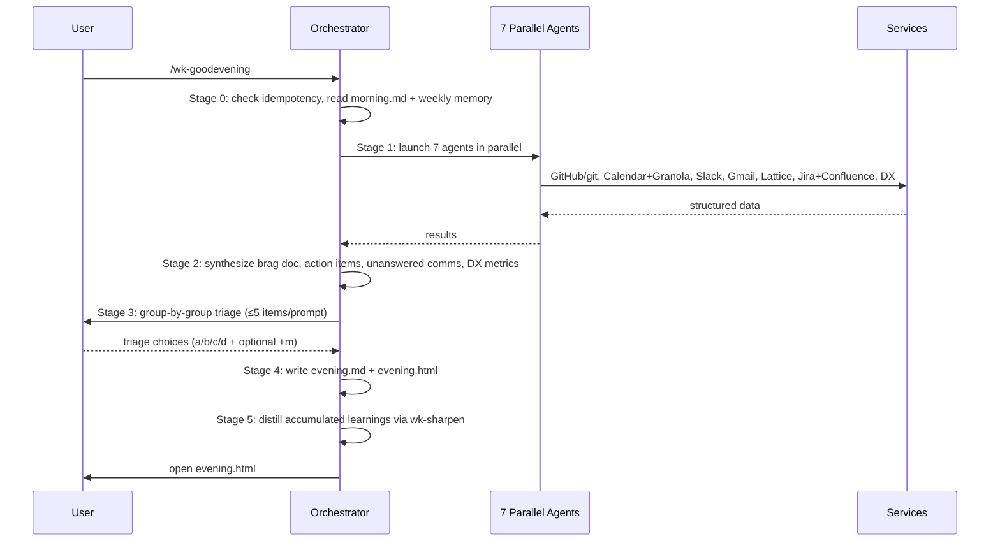

# wk-goodevening

> Wrap up your workday — document achievements, capture meeting insights, audit unanswered comms, track action items, and produce an evening.md for tomorrow's morning brief.

## Invocation

| Mode | Trigger |
|------|---------|
| User-invocable | `/wk-goodevening` at the end of the workday |
| Model-invocable | No |

## How It Works

## Noteworthy

- **7 parallel agents:** GitHub, Calendar+Granola, Slack, Gmail, Lattice, Jira+Confluence, and DX all run concurrently; any agent that fails auth returns a skip notice and does not block the others.
- **Idempotency with version awareness:** If `evening.md` already exists, the skill compares its `generated_with` CalVer against the current skill version. Older → auto-regenerate silently. Equal/newer → prompt user. Prevents accidental overwrite of hand-curated brag notes.
- **Weekly memory (`+m` modifier):** Appending `+m` to any triage choice (e.g., `2c+m`) extracts a pattern and writes an auto-skip/auto-done rule to `sitrep/<YYYY>/<MM>/week-<WW>-memory.md` for the rest of the week.
- **Authorship filter (HARD RULE):** A PR appears in the brag document only if the user is the author, co-author, or primary/approving reviewer. Merging another person's PR is a maintenance action, not an achievement.
- **QPR brag accumulation:** QPR-worthy items are flagged with `🌟` and appended to `QPR/brag-log.md` for quarterly review seasons, pre-distilling signals for `wk-self-perf`.
- **Learning distillation (Stage 5):** After writing the evening files, unprocessed `$WK_SKILLS_HOME/learnings/skills/*.md` files are distilled via `wk-sharpen` and renamed to `.learned.md`.
