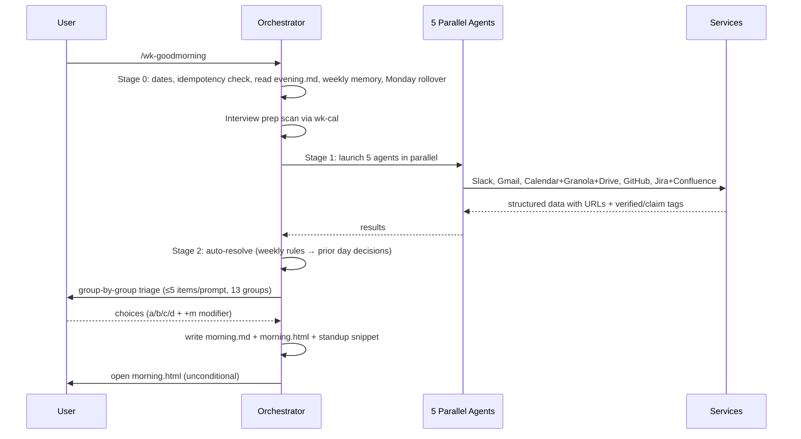

# wk-goodmorning

> Prepare for your day by connecting to Slack, Gmail, Calendar, Granola, Google Drive, and GitHub. Produces a structured morning.md and interactive morning.html dashboard.

## Invocation

| Mode | Trigger |
|------|---------|
| User-invocable | `/wk-goodmorning` at the start of the workday |
| Model-invocable | No |

## How It Works

## Noteworthy

- **Subagent contract is mandatory:** Every Stage 1 agent prompt includes the full contract verbatim — prevents subagents from mistaking themselves for the orchestrator and writing files, committing, or prompting the user independently.
- **Every priority item requires a source link (HARD RULE):** Items without a URL or internal citation (`granola://...`, `(carry-over from ...)`, `(inferred)`) are rejected from the priorities list. Sourceless items are never promoted to hard priorities.
- **Claim vs. verified tagging:** Stage 1 agents tag each item `verified` (concrete artifact) or `claim` (single-source, unconfirmed). Claims render in muted style and are never silently promoted to authoritative deadlines.
- **Standup snippet uses bare URLs (HARD RULE):** Markdown `[text](url)` syntax breaks Slack paste. The standup section always emits raw URLs, and the HTML card has a "Copy to clipboard" button that copies plain text.
- **Monday weekly memory rollover:** On Mondays, the previous week's auto-skip/auto-done rules are surfaced for confirmation before being carried into the new week's memory file.
- **`morning.html` opens unconditionally:** `open "$TODAY_DIR/morning.html"` runs immediately after the file is written — before any announcement, before any commit offer, in auto mode too.
