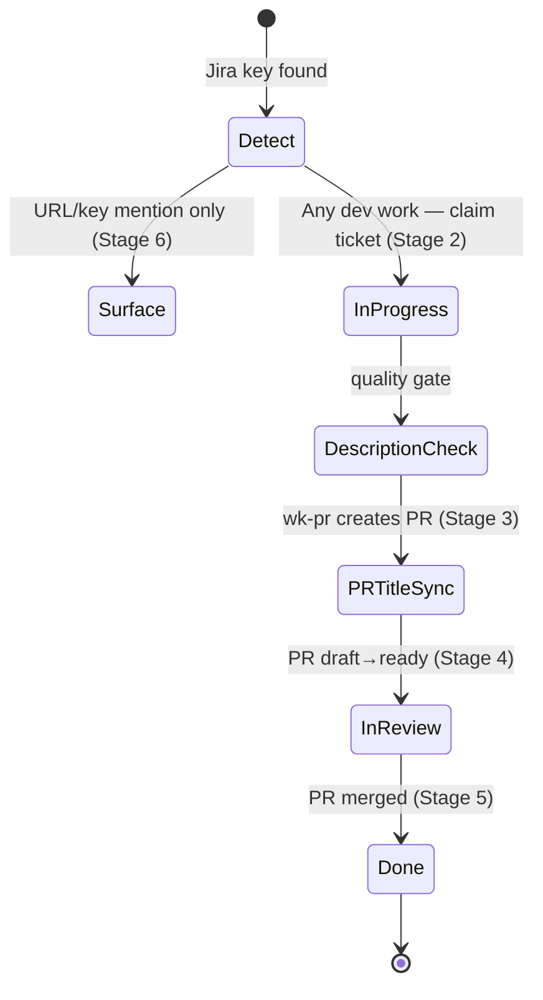

# wk-jira

> Coordinate Jira ticket state with the development lifecycle and surface Jira context whenever the agent encounters a Jira artifact.

**Version:** `2026.07.08-174545`

## Invocation

| Mode | Trigger |
|------|---------|
| User-invocable | Not user-invocable |
| Model-invocable | automatic on: Jira URL or `[A-Z][A-Z0-9]+-\d+` key in prompt/branch/commit/PR body; branch start; PR creation; PR draft→ready; PR merge |

## How It Works

## Noteworthy

- **Never blocks development:** Jira sync failures (MCP unavailable, wrong transition, inaccessible ticket) are reported once and skipped — they never block a commit, push, or PR action.
- **Silent skip when MCP is unavailable:** If `ToolSearch` finds no Jira MCP tools, the skill logs one line and exits. It never falls back to WebFetch or a browser — the browser path is slower and produces unstructured output.
- **HARD RULE — never close a parent with open children:** Before any terminal transition (`Done`/`Closed`/`Resolved`), the Child-completion gate queries children (`statusCategory != Done`); any open child blocks the transition and the skill asks the user to decide. Defaults to hold.
- **Description quality gate runs at every writable stage:** Stages 2, 3, and 4 each invoke the gate, so a session that joins mid-branch (e.g., after the initial commit) still gets a checkpoint before reviewers see the ticket.
- **HARD RULE — confirm before any user-initiated write:** `createJiraIssue`, `editJiraIssue`, and transition calls on user-requested operations all require explicit approval. Jira has no delete API. Auto mode does not exempt this.
- **PR title format is enforced:** `feat(auth): ✨ OAuth login [BOARD-123]` — key in square brackets, last token, exactly one key. If the title already has the wrong key, the skill asks before replacing.
- **Assignee is never stolen:** If a ticket is already assigned to someone else, the skill reports once and leaves it — the work may genuinely be reassigned.
- **HARD RULE — starting work is one atomic, self-healing claim:** Assign-to-user + In Progress + active sprint + a start comment fire together on *any* development intent (edit/commit/PR work), not only the literal first commit — so mid-branch joins and resumed sessions still claim the ticket.
- **HARD RULE — a blocked write is surfaced once, never silently retried:** Auto mode treats a Jira write as an external-system write needing explicit intent (a referenced ticket = context, not authorization). On a permission denial, the skill surfaces the block once and asks the user to confirm intent or add a Jira-write permission rule — it never spins on denials or swallows the block silently.
- **Posts progress comments automatically:** A factual one-line comment (`addCommentToJiraIssue`) is posted at each lifecycle change — claim, PR opened, merged — confirmation-exempt like auto-assign, idempotent to avoid duplicate spam.
