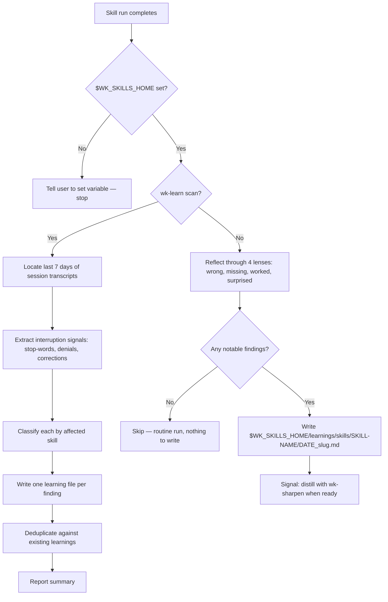

# wk-learn

> Post-completion learning capture for any wk-* skill. Writes a structured learning file for later distillation via wk-sharpen.

## Invocation

| Mode | Trigger |
|------|---------|
| User-invocable | `wk-learn <skill-name>` or `wk-learn scan` |
| Model-invocable | automatic on: end of any wk-* skill run (called by skill's Post-Completion step) |

## How It Works

## Noteworthy

- **Not every run produces a learning:** If all four reflection lenses (wrong, missing, worked, surprised) are empty, no file is written — avoiding noise in the learnings directory.
- **Scan mode mines session transcripts:** `wk-learn scan` parses `~/.claude/projects/` `.jsonl` transcripts for `[Request interrupted by user]` markers and stop-word user messages, then classifies each by the skill involved.
- **HARD RULE — strip incident-specific tokens:** Learning files must not contain session IDs, transcript paths, exact timestamps, or verbatim user prose naming third parties. The principle is distilled, not the incident.
- **Deduplication before write:** Scan mode checks for existing `(skill, slug)` files including `.learned.md` archives. Duplicate findings append a `## Additional evidence` bullet rather than creating a parallel file.
- **`.learned.md` extension signals absorption:** After [`wk-sharpen`](../sharpen/README.md) distills a learning into a skill, the owning skill renames the file from `.md` to `.learned.md` so it is never re-processed.
- **Feeds batch distillation:** Learnings accumulate during the day and are batch-distilled when [`wk-sharpen`](../sharpen/README.md) runs on unprocessed files.
- **Validate the filename suffix before staging:** a new learning ends in `.md`, never `.learned.md` (which marks an already-distilled file and is skipped by [`wk-sharpen`](../sharpen/README.md)); confirm the path matches `<YYYY-MM-DD>_<slug>.md`.
