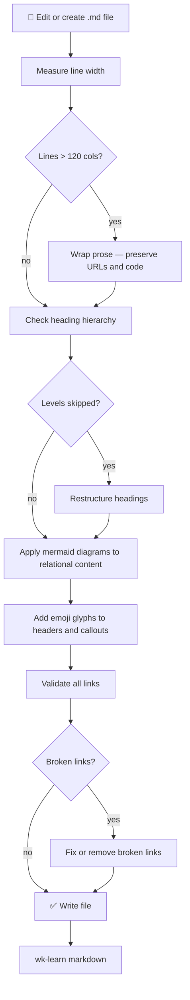

# wk-markdown

> Enforce markdown standards — 120-column line width, heading hierarchy, mermaid diagrams, glyphs, and link
> validation — whenever creating or editing any `.md` file.

## Invocation

| Mode | Trigger |
|------|---------|
| User-invocable | `/wk-markdown` |
| Model-invocable | Automatic on: any `.md` file edit, documentation task, README authoring, or markdown content work |

## How It Works

## Noteworthy

- **HARD RULE — mermaid over ASCII:** Any relational, hierarchical, or flow content requires a mermaid diagram;
  plain lists or ASCII art are not acceptable substitutes. Exceptions: changelogs, glossaries, content with no
  structural relationships.
- **Link validation is mandatory before write:** HTTP links must return 2xx/3xx; relative paths must resolve;
  anchors must match an existing heading. A broken link is a documentation bug — not a warning.
- **Heading H1 is singular:** Exactly one `# Title` per file. H5/H6 are forbidden; restructure deep content
  into sub-documents instead.
- **Emoji in headers, not in code:** Glyphs aid scanning when applied to section headers and callout
  blockquotes; they are never embedded inside inline code, filenames, CLI flags, or URLs.
- **120-column rule has hard exceptions:** Never wrap URLs mid-link, fenced code blocks, or table cells where
  splitting would change meaning — leave them as-is even when they exceed the limit.
- **Post-run learning:** Invokes `wk-learn markdown` on completion to capture session findings for future
  distillation via `wk-sharpen`.
