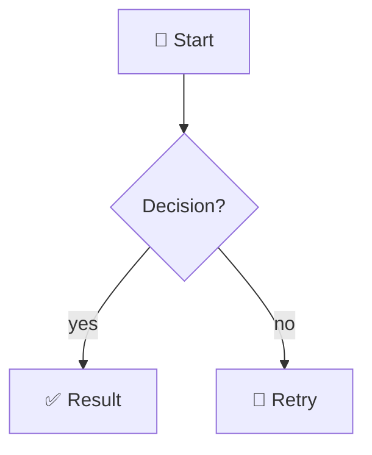

# 📝 Markdown

Standards and validation checks for creating and editing markdown files.

## When to Use

- Creating or editing any `.md` file
- Writing documentation, READMEs, specs, ADRs, or any prose content
- Converting existing content to markdown
- Reviewing or updating existing markdown for compliance

## 📐 Line Width

Hard-wrap all prose at **120 columns**. Each paragraph line must be ≤ 120 characters.

Exceptions — never wrap:
- Fenced or inline code blocks
- URLs (never break mid-URL; if a URL alone exceeds 120 cols, leave it as-is)
- Table cell content that cannot be split without changing meaning

Quick measure:

```bash
awk 'length > 120 {print NR": "length" chars: "$0}' <file>
```

Fix every line that appears in the output before writing.

## 🗂️ Heading Hierarchy

- **Never skip heading levels** — H3 must follow H2, H2 must follow H1.
- **H1** — document title only; exactly one per file.
- **H2** — major sections.
- **H3** — subsections within a major section.
- **H4** — named callouts or detail items within a subsection.
- **Avoid H5/H6** — if content needs that depth, restructure into sub-documents.

## 🧭 Mermaid Diagrams

**HARD RULE:** Use a mermaid diagram for any relational, hierarchical,
sequential, or flow content. Never substitute ASCII art, plain lists, or
prose tables for structure that a diagram would make scannable.

| Content type | Mermaid diagram type |
|---|---|
| Steps or processes | `flowchart TD` / `sequenceDiagram` |
| Component relationships | `graph LR` / `graph TD` |
| Timelines or milestones | `gantt` |
| State machines | `stateDiagram-v2` |
| Entity relationships | `erDiagram` |
| Class or type structures | `classDiagram` |
| Git branching | `gitGraph` |

Wrap all diagrams in a fenced block with the `mermaid` language tag:

````markdown

````

Diagrams are NOT required for changelogs, glossaries, or content with no
structural relationships.

## ✨ Glyphs and Emojis

Use thematically matched emojis in headers and callout blocks to aid visual
scanning. Apply them consistently — pick one per category and stick to it.

### Header emojis (examples)

| Topic | Emoji |
|---|---|
| Deployment / release | 🚀 |
| Security / auth | 🔒 |
| Packages / dependencies | 📦 |
| Configuration | ⚙️ |
| Testing | 🧪 |
| Documentation | 📝 |
| Warning / caution | ⚠️ |
| Success / done | ✅ |
| Failure / error | ❌ |
| Performance | ⚡ |
| Database | 🗄️ |
| API | 🔌 |
| Architecture / structure | 🏗️ |

### Callout blocks

Use admonition-style blockquotes with a leading glyph:

```markdown
> ⚠️ **Warning:** This action is irreversible.

> 💡 **Tip:** Run the linter before committing.

> 📌 **Note:** This only applies to Linux environments.
```

Do NOT embed emojis inside inline code, filenames, CLI commands, or URLs.

## 🔗 Link Validation

**HARD RULE:** All links must be validated before the file is written or committed.
A broken link is a documentation bug.

Extract and validate all links with:

```bash
grep -oE '\[([^\]]+)\]\(([^)]+)\)' <file> | grep -oE '\(([^)]+)\)' | tr -d '()' | while read -r url; do
  case "$url" in
    http*) curl -sI --max-time 10 --location "$url" 2>&1 | grep -E '^HTTP' | tail -1 ;;
    \#*)   echo "anchor: $url (verify heading exists)" ;;
    *)     stat "$(dirname <file>)/$url" 2>/dev/null && echo "ok: $url" || echo "MISSING: $url" ;;
  esac
done
```

Verify:
- External links return 2xx/3xx — 4xx/5xx must be fixed or removed before writing.
- Relative paths resolve to existing files — `MISSING` means fix the path or remove the link.
- Anchor targets (`#foo`) match an existing heading in the same file (GFM rules: lowercase, spaces → `-`, punctuation stripped).

---

## Post-Completion

Invoke `wk-learn` with this skill's short name as the argument (e.g., `wk-learn markdown`).
