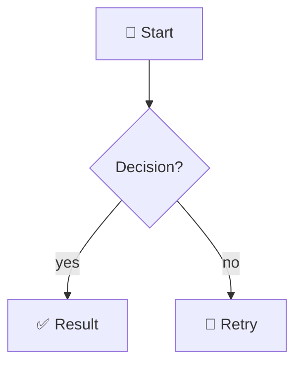

# 📝 Markdown

Apply to every `.md` create/edit — docs, READMEs, specs, ADRs, conversions, compliance reviews.

## 📐 Line Width

Hard-wrap all prose at **120 columns**. Each paragraph line must be ≤ 120 characters.

Never wrap fenced or inline code blocks, URLs (never break mid-URL; a URL alone exceeding 120 cols stays as-is), or
table cell content that cannot be split without changing meaning. Measure, then fix every line in the output before
writing:

```bash
awk 'length > 120 {print NR": "length" chars: "$0}' <file>
```

## 🗂️ Heading Hierarchy

- **Artifact templates override this hierarchy.** When another active skill prescribes an exact Markdown shape,
  preserve it — including a deliberate absence of H1; apply these generic rules only where the template is silent.
- **Never skip heading levels** — H3 must follow H2, H2 must follow H1.
- **H1** — document title only; exactly one per file.
- **H2** — major sections.
- **H3** — subsections within a major section.
- **H4** — named callouts or detail items within a subsection.
- **Avoid H5/H6** — if content needs that depth, restructure into sub-documents.

## 🧭 Mermaid Diagrams

**HARD RULE:** Use a mermaid diagram for any relational, hierarchical, sequential, or flow content. Never substitute
ASCII art, plain lists, or prose tables for structure that a diagram would make scannable. Not required for
changelogs, glossaries, or content with no structural relationships.

Pick the type: steps/processes → `flowchart TD` / `sequenceDiagram`; component relationships → `graph LR` /
`graph TD`; timelines/milestones → `gantt`; state machines → `stateDiagram-v2`; entity relationships → `erDiagram`;
class/type structures → `classDiagram`; git branching → `gitGraph`. Wrap every diagram in a fenced `mermaid` block:

````markdown

```mermaid
flowchart TD
    A[🚀 Start] --> B{Decision?}
    B -->|yes| C[✅ Result]
    B -->|no| D[🔁 Retry]
```
````

## ✨ Glyphs and Emojis

Use thematically matched emojis in headers and callout blocks; pick one per category and stick to it. Header
examples: 🚀 deployment/release, 🔒 security/auth, 📦 packages/dependencies, ⚙️ configuration, 🧪 testing,
📝 documentation, ⚠️ warning/caution, ✅ success/done, ❌ failure/error, ⚡ performance, 🗄️ database, 🔌 API,
🏗️ architecture/structure. Callouts are admonition-style blockquotes with a leading glyph:

```markdown
> ⚠️ **Warning:** This action is irreversible.

> 💡 **Tip:** Run the linter before committing.

> 📌 **Note:** This only applies to Linux environments.
```

Do NOT embed emojis inside inline code, filenames, CLI commands, or URLs.

## 🔗 Link Validation

**HARD RULE:** All links must be validated before the file is written or committed. Extract and validate with:

```bash
grep -oE '\[([^\]]+)\]\(([^)]+)\)' <file> | grep -oE '\(([^)]+)\)' | tr -d '()' | while read -r url; do
  case "$url" in
    http*) curl -sI --max-time 10 --location "$url" 2>&1 | grep -E '^HTTP' | tail -1 ;;
    \#*)   echo "anchor: $url (verify heading exists)" ;;
    *)     stat "$(dirname <file>)/$url" 2>/dev/null && echo "ok: $url" || echo "MISSING: $url" ;;
  esac
done
```

- External links return 2xx/3xx — 4xx/5xx must be fixed or removed before writing.
- Relative paths resolve to existing files — `MISSING` means fix the path or remove the link.
- Anchor targets (`#foo`) match an existing heading in the same file (GFM rules: lowercase, spaces → `-`, punctuation
  stripped).

## Post-Completion

Invoke `wk-learn markdown`.
