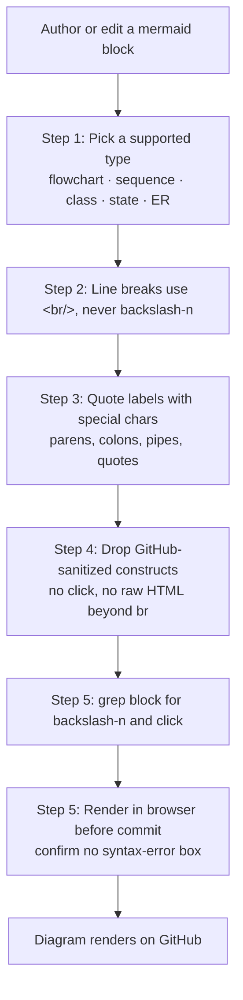

# wk-mermaid

> Author Mermaid diagrams that render correctly on GitHub — the strictest common target.

**Version:** `2026.06.26-003822`

## Invocation

| Mode | Trigger |
|------|---------|
| User-invocable | `/wk-mermaid` — audit mermaid blocks in the current file/repo |
| Model-invocable | automatic: whenever the agent authors or edits a ```mermaid block |

## How It Works



## Noteworthy

- **Literal `\n` is the #1 GitHub mermaid failure** — it renders as two visible characters, not a line break. Use `<br/>` (or `<br>`); grep every block for `\n` before writing.
- **GitHub sandboxes Mermaid** — `click`/JS interactivity is stripped and raw HTML beyond `<br/>` is sanitized, so diagrams that work on mermaid.live can still fail here.
- **Quote any label with punctuation** beyond letters, digits, spaces, and hyphens — unquoted `()`, `:`, `|`, `{}` break the parse; node IDs stay alphanumeric while human text lives in the quoted bracket label.
- **Validation is part of authoring** — grep for `\n`/`click` (catches only known string patterns), then render every added or modified diagram in a browser before committing; structural parse errors are invisible to grep and diff and surface only on render.
- Defers broad markdown formatting (width, headings, link checks) to [wk-markdown](../markdown/README.md); this skill owns mermaid render-correctness only.
