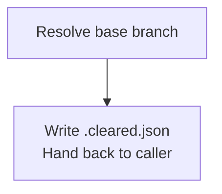
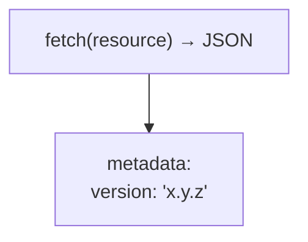

# Mermaid

Author Mermaid diagrams that render correctly on **GitHub** (the strictest
common target). GitHub renders Mermaid in a sandboxed, sanitized context —
several constructs that work in mermaid.live fail or render as raw text on
GitHub. Apply these rules to every mermaid block.

## When to Use

- Writing or editing any ```mermaid fenced block in a `.md` file.
- A flowchart, sequence, class, state, or ER diagram in a README, spec, or doc.
- Auto-invoke before emitting any mermaid block; defer broad markdown
  formatting (headings, width, link checks) to [wk-markdown](../markdown/README.md).

## Step 1: Pick a supported diagram type

GitHub supports a subset. Match content to type:

| Content | Type |
|---------|------|
| System flow, pipeline, decision tree | `flowchart TD` / `flowchart LR` |
| Request/response, API interaction | `sequenceDiagram` |
| Type hierarchy, class relationships | `classDiagram` |
| State machine, lifecycle | `stateDiagram-v2` |
| Entity relationships | `erDiagram` |

- Use `stateDiagram-v2`, never the legacy `stateDiagram`.
- Fence every diagram with a ```mermaid language tag — an untagged block
  renders as a plain code block, not a diagram.

## Step 2: Line breaks use `<br/>`, never `\n`

**HARD RULE:** A literal `\n` in a node label renders as the two visible
characters `\n` on GitHub — it is **not** a line break. Use `<br/>`.



- `<br/>` and `<br>` both work; prefer `<br/>` (XHTML-safe).
- This is the single most common GitHub mermaid failure — grep proposed
  blocks for `\n` before writing.

## Step 3: Quote labels that carry special characters

Unquoted `()`, `{}`, `[]`, `#`, `:`, `;`, `<`, `>`, `&`, `|`, or quotes in a
label break the parse or render wrong. Wrap the whole label in double quotes.



- Quote any label containing punctuation beyond letters, digits, spaces, and
  hyphens.
- A pipe `|` inside an **edge** label (`-->|text|`) must be quoted or removed —
  it terminates the edge label otherwise.
- Keep node **IDs** alphanumeric (`A`, `B1`, `step2`); put all human text in the
  bracketed label, not the ID.

## Step 4: Avoid GitHub-sanitized constructs

- **HARD RULE — a Mermaid `click` target on GitHub MUST be an absolute URL.**
  Two distinct, silent failure modes:
  - `click X call <fn>` (JS callback) → the sanitizer strips it; does nothing.
  - `click X href "./rel"` / `"../rel"` / `"#anchor"` → renders as a real link
    but resolves against the **sandboxed mermaid iframe origin**, not the repo
    → **404**. The link looks wired up; every relative target is silently broken.
  - `click X href "https://…full URL…"` → navigates correctly.
  - Prefer a markdown link beside the diagram for navigation. If you keep a
    `click`, its target must be an absolute URL — never relative, never a bare
    anchor. (`.githooks/check-mermaid-links.sh` enforces this where present.)
- **No raw HTML beyond `<br/>`** in labels — other tags are sanitized.
- **No external `%%{init}%%` themes that assume a script context** — basic
  `%%{init: {...}}%%` config works, but keep it minimal; complex theming may
  not apply.

## Step 5: Validate the render

A block that parses locally can still fail on GitHub. Verify before declaring
done.

- Grep the block for known failure patterns: a literal `\n` (always wrong), and
  a relative/anchor click target in either click form —
  `grep -nE '\\n|^[[:space:]]*click[[:space:]]+[^"]*"(\./|\.\./|#)' <file>` must
  return nothing. (Anchored on `click`, so prose is not matched; absolute-URL
  clicks are fine.)
- **HARD RULE — grep is necessary but not sufficient; render every added or
  modified diagram in a browser before committing.** Grep catches only known
  string patterns (`\n`, `click`); a structural syntax error — a malformed
  `opt`/`alt`/`loop`/`par` block, a stray keyword, an unclosed subgraph — is
  invisible to both `git diff` and grep and surfaces only on render, breaking
  the whole page. Open the file's GitHub blob URL (or a local preview) in a
  browser via Playwright; confirm the diagram renders with no Mermaid syntax
  error box and nodes show line breaks, not literal `\n`. Commit only after it
  renders clean.
- When fixing existing diagrams across many files, sweep mermaid-fenced lines
  only — never replace `\n` in surrounding prose.

## Quick Reference

| Trigger | Behavior |
|---------|----------|
| Authoring a mermaid block | Apply Steps 1–4, then validate (Step 5) |
| `/wk-mermaid` | Audit mermaid blocks in the current file/repo for these rules |
| Fixing broken GitHub diagrams | Replace `\n` → `<br/>`, quote special-char labels, make every `click` target absolute |

## Requirements

- Read/Edit access to the markdown file being authored.
- Optional: Playwright browser tools to validate the GitHub render.

## Common Mistakes

- **Literal `\n` for line breaks** — renders as visible `\n` on GitHub; use
  `<br/>`. (The recurring failure this skill exists to prevent.)
- **Unquoted parentheses/colons in labels** — break the parse; quote the label.
- **Relative `click` target** — renders but 404s against GitHub's sandboxed
  mermaid iframe; only absolute URLs navigate (`call` JS handlers are stripped).
- **Forgetting the `mermaid` fence tag** — renders as a code block, not a diagram.

---

## Post-Completion

Invoke `wk-learn` with this skill's short name as the argument
(e.g., `wk-learn mermaid`).
