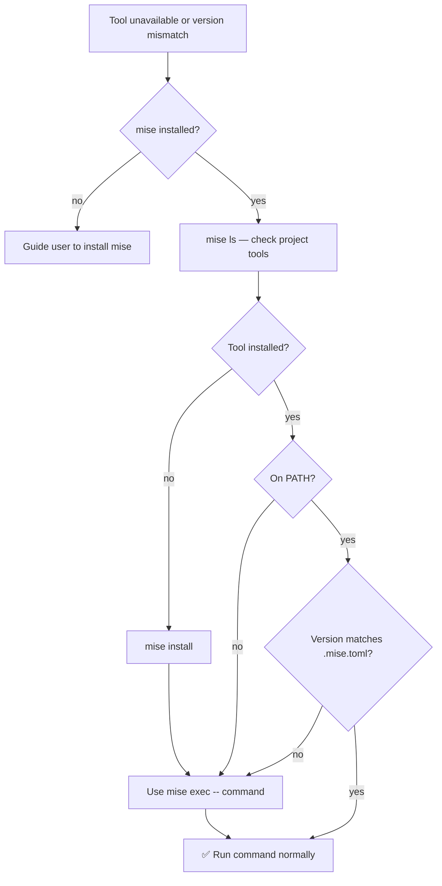

# wk-mise

> Manage mise (formerly rtx) tool versions — install tools, fix "command not found" in non-interactive shells,
> diagnose version mismatches, and run commands with the correct runtime context.

## Invocation

| Mode | Trigger |
|------|---------|
| User-invocable | `/wk-mise` |
| Model-invocable | Automatic on: `command not found` for a mise-managed tool, `.mise.toml` / `.tool-versions` detected, runtime version mismatch errors, or `mise doctor` output in the shell |

## How It Works

## Noteworthy

- **Root cause of "command not found" in Claude/CI:** Mise shims live in `~/.local/share/mise/shims/` which is
  not on `$PATH` in non-interactive shells. The fix is always `mise exec -- <command>`, not reinstalling the
  tool.
- **Silent failure mode:** When the system tool version is on PATH but differs from the project's pinned
  version, failures appear as confusing build/runtime errors — not "command not found". Go compile errors,
  Ruby Gemfile version mismatches, and Python syntax errors are all mise-mismatch signals.
- **Apply `mise exec --` to every invocation:** A working bare invocation silently breaks when the system
  version drifts. Prefix all mise-managed tool calls in a repo with a `.mise.toml` entry.
- **Git hooks and mise:** Hooks (lefthook, husky) fail with exit 127 for the same shims-not-on-PATH reason.
  Fix with `eval "$(mise activate bash)" && git push` before pushing from a mise-managed repo.
- **Pin exact versions:** Never use `latest` or `lts` in `.mise.toml` — `mise use node@22.3.0` not
  `node@latest`.
- **`.mise.toml` takes precedence over `.tool-versions`** when both exist in the same directory.
