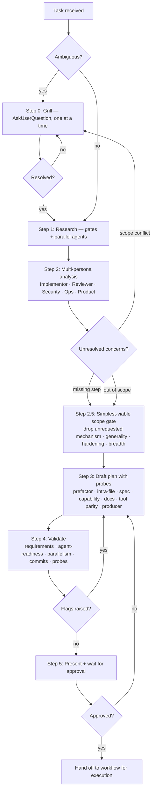

# wk-plan

> Use when planning any non-trivial task — grills for ambiguities, researches the codebase in parallel, validates from multiple personas, and produces an explicitly-numbered, agent-parallelizable plan ready for [wk-workflow](../workflow/README.md) execution.

**Version:** `2026.08.05-212658`

## Invocation

| Mode | Trigger |
|------|---------|
| User-invocable | `/wk-plan <task description>` |
| Model-invocable | automatic when [wk-workflow](../workflow/README.md) Phase 1 begins; or when the user says "plan this", "let's plan", "make a plan for…" |

## How It Works



## Plan Format

Every plan produced by this skill uses explicit markers:

```
### Phase A: <Title>  [PARALLEL]

**Step A1**  [AGENT-READY]
- Goal: …
- Artifacts out: …
- Instructions: 1. … 2. …
- Commit after: feat(scope): message
```

| Marker | Meaning |
|---|---|
| `[PARALLEL]` | All steps in this phase run concurrently |
| `[SEQUENTIAL]` | Each step waits for the previous |
| `[AGENT-READY]` | Agent can complete autonomously |
| `[AGENT-GUIDED]` | Agent executes, reports back before continuing |
| `[HUMAN-IN-LOOP]` | User decision required before step completes |

## Research Gates

Before agent dispatch, clear these gates in order:

- **Jira ticket pre-flight** — resolve ticket status before any exploration.
- **User-provided artifacts first** — read URLs, PRs, files, build IDs, or stack frames before spawning agents.
- **MCP-before-client check** — prefer MCP for interactive third-party calls when available.

## Planning Probes

Run these probes during research and validation:

- **Prefactor probe** — lift shared logic before adding a new caller of an existing pattern.
- **Intra-file duplication probe** — grep large mixed-content files before adding a new block.
- **Spec pre-flight** — extend an in-flight spec on an open PR before creating a new one.
- **New-capability probe** — add a mode to an existing skill before scaffolding a standalone skill.
- **Rule-set doc sync probe** — sync authoring guides that enumerate rule counts.
- **Tool-swap flag-parity probe** — verify replacement tool defaults and flags.
- **Producer-audit probe** — audit upstream producers before switching from named-file lookup to directory scan.
- **Secret-ownership probe** — establish each runtime secret's provisioning
  owner and mode before assigning infrastructure or cross-repository work.

## Noteworthy

- **HARD RULE:** Do not start executing any step until the user explicitly approves the plan — silence is not approval.
- **HARD RULE:** Stop at Step 0 when requirements are vague, missing acceptance criteria, or conflicting — planning a wrong requirement produces more rework than grilling.
- **Parallelism default:** Steps that don't share a write target and don't have a data dependency go in the same parallel phase. Sequential ordering must be justified.
- **Mandatory 8 elements:** Every plan must include implementation steps, commit boundaries, docs updates, testing, one adversarial review at the completion gate, PR offer, CI fix loop, and session retro — the plan is invalid without all 8. A 9th element fires conditionally: when a ticket key is in scope, Jira lifecycle transitions appear as named numbered steps (each `[AGENT-READY]` with an auto-mode-may-block caveat), not invisible side-effects.
- **Progressive disclosure:** SKILL.md stays under 500 lines; detailed probes are compressed into gates and validation checklist.
- **Multi-persona pass:** The plan is validated from Implementor, Reviewer, Security, Ops, and Product perspectives. Every concern is either addressed by a step or explicitly excluded with a rationale.
- **[wk-workflow](../workflow/README.md) integration:** Phase 1 calls `Skill(wk-plan)` instead of inline planning. An approved plan from this session short-circuits the workflow's own planning step.
- **Model:** Uses Opus-class models (`opus`, `gpt-5.6-sol`, `gemini-2.5-pro`) at `xhigh` effort for deep
  multi-persona reasoning.

## Integration Points

| Skill | Relationship |
|---|---|
| [wk-workflow](../workflow/README.md) | Phase 1 delegates to this skill; executes the approved plan |
| [wk-jira](../jira/README.md) | Step 1 pre-flight fetches ticket acceptance criteria via Stage 0+1+2 |
| [wk-adversarial-review](../adversarial-review/README.md) | Every plan includes exactly one adversarial review step, at the completion gate |
| [wk-arch-review](../arch-review/README.md) | Mandatory element 9 — owns the authoring path: one review at draft-complete, before the plan is presented |
