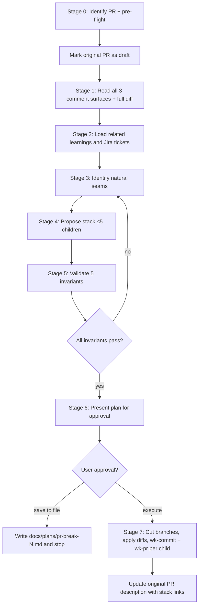

# wk-pr-break

> Split a large PR into a stack of smaller, individually-shippable PRs without losing functionality, breaking
> review continuity, or shipping a half-finished state on any intermediate branch.

**Version:** `2026.06.12-015811`

## Invocation

| Mode | Trigger |
|------|---------|
| User-invocable | `/wk-pr-break [pr-number-or-url]` |
| Model-invocable | Automatic on: "split this PR", "break down this PR", "make smaller PRs from this", or when [`wk-pr-review`](../pr-review/README.md) flags a PR as too large |

## How It Works

## Noteworthy

- **Five invariants are non-negotiable:** (1) functional equivalence, (2) isolation (each child builds+tests
  alone), (3) stack-order coherence, (4) description completeness, (5) reviewer digestibility. A plan
  violating any invariant is sent back to Stage 3 — never shipped.
- **Auto mode stops at Stage 6:** Building a PR stack is destructive and exceeds the autonomy budget for
  unattended runs. The plan is saved to `docs/plans/pr-break-{pr-num}.md` and execution requires explicit
  approval.
- **Original PR returns to draft immediately:** Before any planning, the source PR is converted back to draft
  to prevent approvals, auto-merge, or wasted reviewer time during the split.
- **Stack cap is 5 children:** More than 5 indicates over-fragmentation. Cap forces merging of the smallest
  pieces back together rather than nano-PRs.
- **Annotation routing is explicit:** `Closes #N` goes only on the final child; `[BOARD-NUM]` Jira keys go on
  every child's title; design doc links go on every child. Each child block includes an "Annotations
  propagated" subsection for user audit.
- **Branches use `-part-N` suffix on the original name:** `feat/foo-part-1`, `feat/foo-part-2`, etc. Name
  collisions abort the run rather than silently overwriting prior attempts.
