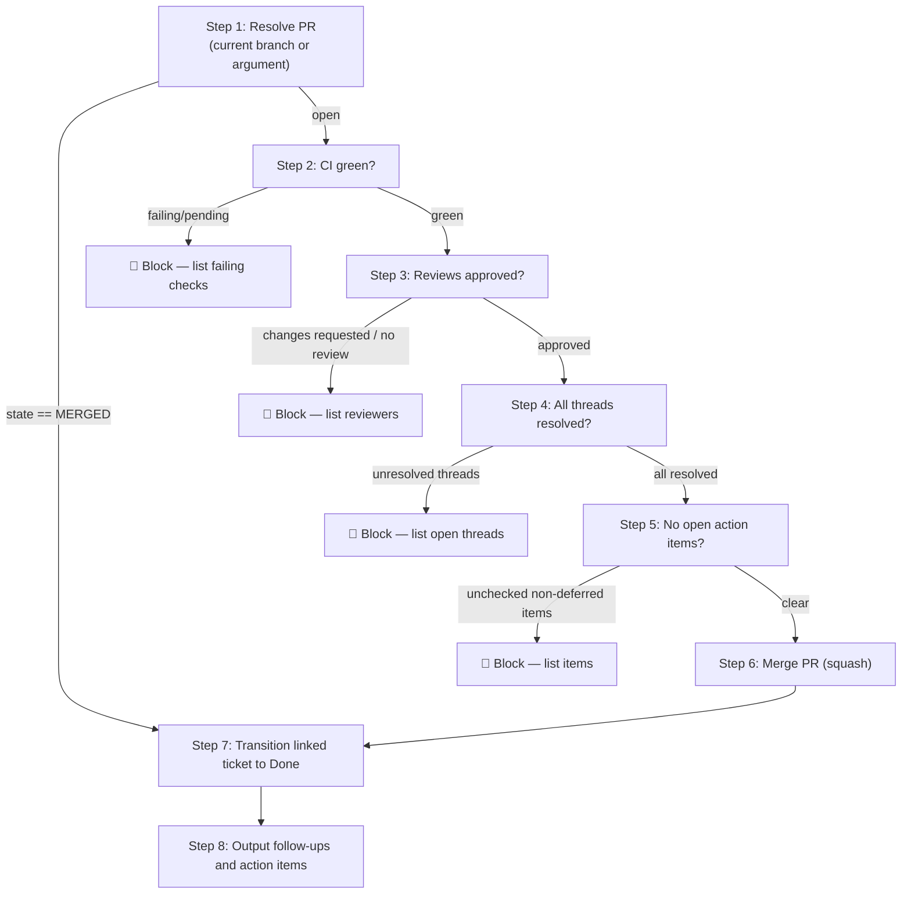

# wk-pr-merge

> Gate the merge of a pull request behind a full pre-merge checklist, then
> merge, transition the linked ticket to its terminal state, and surface
> any follow-ups and deferred action items.

**Version:** `2026.07.20-213546`

## Invocation

| Mode | Trigger |
|------|---------|
| User-invocable | `/wk-pr-merge` (current branch) or `/wk-pr-merge 123` (explicit PR) |
| Model-invocable | `false` — user-initiated gate only |

## How It Works

## Checks Before Merge

All four must pass; any failure blocks and reports what needs fixing:

- CI: all required checks green on HEAD SHA (non-required checks are informational — never polled or blocked on)
- Reviews: `reviewDecision = APPROVED` (or no required reviewers)
- Threads: reviewer/bot threads resolved or triaged (author's own self-review threads may stay open)
- Action items: no unchecked `- [ ]` outside designated deferred sections

## Ticket Handling

| Source | How resolved |
|--------|-------------|
| Jira (`[A-Z]+-\d+` or `atlassian.net` URL) | Transition to terminal state via Jira MCP; post shipped comment |
| GitHub issue (`Closes #N` annotation) | `gh issue close` with merge-commit reference |
| Asana / other | Noted as limitation — user must close manually |

## Noteworthy

- **[`wk-pr-resolve`](../pr-resolve/README.md) first if threads exist** —
  resolve outstanding review comments before invoking this skill.
- **Never auto-resolve the author's own self-review threads** — they are
  informational and left open; the Step 6 merge attempt is the ground-truth
  probe of whether branch protection actually counts them.
- **Squash is the default** — the skill detects repo merge settings and
  respects overrides, but squash is the safe default for clean history.
- **Jira auto-close does not happen via `Closes #N`** — GitHub's
  auto-close only works for GitHub Issues. Jira always needs an
  explicit transition call.

## ⚠️ Status

Scaffold written — RED phase not yet run. Steps 1–8 contain `DESIGN NOTES`
describing intended behaviour; implementation lands after RED documents
baseline failures.
