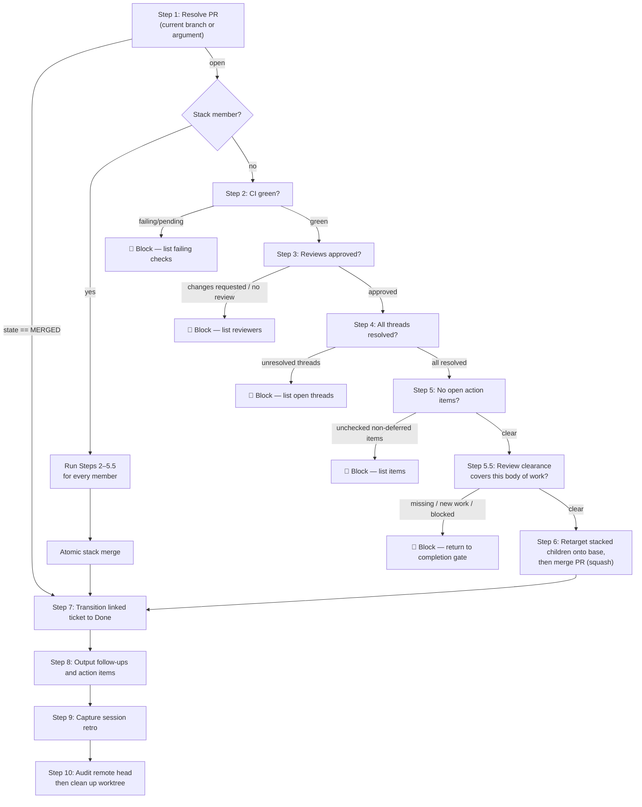

# wk-pr-merge

> Gate the merge of a pull request behind a full pre-merge checklist, then
> merge, transition the linked ticket to its terminal state, and surface
> any follow-ups and deferred action items. Merge consumes the completion
> gate's adversarial-review clearance and never dispatches another review.

**Version:** `2026.08.05-205230`

## Invocation

| Mode | Trigger |
|------|---------|
| User-invocable | `/wk-pr-merge` (current branch) or `/wk-pr-merge 123` (explicit PR) |
| Model-invocable | `false` — user-initiated gate only |

## How It Works

## Checks Before Merge

All five must pass; any failure blocks and reports what needs fixing:

- CI: all required checks green on HEAD SHA; superseded cancellations wait for their live replacement
  (non-required checks are informational — never polled or blocked on)
- Reviews: `reviewDecision = APPROVED` (or no required reviewers)
- Threads: reviewer/bot threads resolved or triaged (author's own self-review threads may stay open)
- Action items: no unchecked `- [ ]` outside designated deferred sections
- Review: clear completion-gate record; finding-response commits and
  tree-identical rewrites preserve its lineage

## Ticket Handling

| Source | How resolved |
|--------|-------------|
| Jira (boundary-delimited key; footer removed) | Jira MCP transition + shipped comment |
| GitHub issue (`Closes #N` annotation) | `gh issue close` with merge-commit reference |
| Asana / other | Noted as limitation — user must close manually |

## Noteworthy

- **[`wk-pr-resolve`](../pr-resolve/README.md) first if threads exist** —
  resolve outstanding review comments before invoking this skill.
- **Merge never dispatches [`wk-adversarial-review`](../adversarial-review/README.md)** —
  it reads completion-gate clearance. Missing clearance or genuinely new work
  returns to [`wk-workflow`](../workflow/README.md) Phase 5.5.
- **Stack membership is reconciled before single-PR gates** — the local set is
  refreshed through the official PR-URL checkout path and must match submitted
  membership; every reconciled member clears the gates before one atomic
  `gh stack merge`.
- **Explicit repository identity is authoritative.** Resolve `{owner}/{repo}`
  from the PR URL and use it for every scoped read, mutation, merge, branch
  deletion, and verification; ambient organization scope is discovery-only.
- **Blocked with required checks green still needs a ruleset diff** — a required
  context with no HEAD run is absent from the visible check list, not passing.
- **Remote state is re-resolved before every post-fix push or merge.** A
  concurrent merge skips the mutation and resumes post-merge processing;
  interrupted commands require remote-state verification before retry.
- **Already merged at entry still audits branch cleanup** — verify the remote
  head, retarget open children, then apply the normal deletion preference.
  Retain and report the branch if a child cannot be retargeted.
- **Never auto-resolve the author's own self-review threads** — they are
  informational and left open; the Step 6 merge attempt is the ground-truth
  probe of whether branch protection actually counts them.
- **Squash is the default** — the skill detects repo merge settings and
  respects overrides, but squash is the safe default for clean history.
- **Jira auto-close does not happen via `Closes #N`** — GitHub's
  auto-close only works for GitHub Issues. Jira always needs an
  explicit transition call.
- **Ticket detection ignores outbound metadata** — strip only the terminal
  canonical [`wk-gh`](../gh/README.md) footer, then reject alphanumeric,
  underscore, and percent-sign adjacency so encoded fragments, timestamps,
  URLs, versions, and larger identifiers cannot become tickets.
