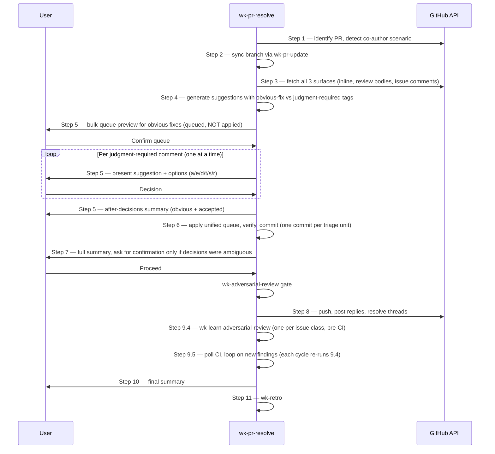

# wk-pr-resolve

> Address PR review comments interactively — implement fixes, draft responses,
> and manage the full resolution cycle from branch sync through push, CI
> polling, and session retro.

**Version:** `2026.07.20-235059`

## Invocation

| Mode | Trigger |
|---|---|
| User-invocable | `/wk-pr-resolve [PR number or URL]` |
| Model-invocable | Automatic on PR resolve triggers |

## How It Works

## Noteworthy

- **Resume after compaction:** When the session resumes from a context-compaction
  summary mid-skill, identify the last completed step, confirm the resume point,
  re-run stale sync/fetch, and never silently drop tail steps (Step 9.4 learnings,
  Step 9.5 CI loop, Step 11 retro).
- **HARD RULE — Step 5 is execution-free:** Obvious-fix items are **queued**
  into `fixes_to_apply`, not auto-applied mid-Step-5. Triage finishes before
  Step 6 executes the unified queue.
- **HARD RULE — one comment per message in Step 5:** Auto mode does not
  collapse the consultation loop. Each `judgment-required` item gets its own
  prompt + response cycle; batching is never allowed.
- **Dismissal reuses the presented rationale:** A `d` Dismiss reuses the Step 4
  `Why skip` rationale already shown for that comment — no re-ask — prompting only
  when that rationale is empty or to edit it.
- **Three comment surfaces are mandatory:** Inline review comments, review
  summary bodies, and PR conversation (issue) comments must all be fetched
  every run. Cached results from a prior invocation in the same session do not
  count — bots can post late.
- **One commit per triage unit:** Step 4's final merge/split decision defines
  the commit unit, so reviewers can trace each resolved finding without
  bundling unrelated comments. All commits push together in Step 8.
- **Adversarial-review gate before push:** Any commits produced in the session
  must pass [`wk-adversarial-review`](../adversarial-review/README.md) before
  Step 8's `git push`. Blocked means no push.
- **Bot-native reply commands are preferred:** Before drafting a freeform reply
  to a bot finding, the skill checks the bot's documented command grammar and
  uses it. Generic replies leave findings open and add noise.
- **No plan-and-ask on a settled contradiction:** A new bot finding that
  contradicts an earlier-accepted fix pauses for the user only when genuinely
  unresolved; a dismissal backed by convention/schema is decided under Auto Mode
  and acted on directly, with no plan.
- **Self-review threads are excluded:** Threads where the root comment was
  authored by the PR author or the current user are skipped for triage and
  resolution — they are not reviewer feedback.
- **HARD RULE — Step 9.4 feedback loop to adversarial-review (pre-CI-wait):**
  Every session emits one [`wk-learn`](../learn/README.md) adversarial-review
  per issue class surfaced. The capture runs **before** the Step 9.5 CI wait so
  the work happens in active foreground time. Every reviewer-caught finding is
  a coverage gap in pre-flight by definition; logging it forces the next
  [`wk-sharpen`](../sharpen/README.md) batch to fold the detection into
  adversarial-review's mechanical sweeps. The Step 9.5 loop re-runs Step 9.4
  for each cycle's newly surfaced findings.
