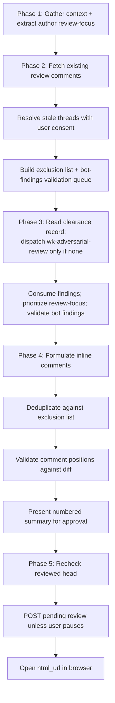

# wk-pr-review

> Thorough, adversarial code review of a GitHub PR — delegates deep investigation
> to [`wk-adversarial-review`](../adversarial-review/README.md) and posts a pending
> review for human submission.

**Version:** `2026.08.17-212559`

## Invocation

| Mode | Trigger |
|------|---------|
| User-invocable | `/wk-pr-review [PR number or URL]` |
| Model-invocable | Automatic on: "review this PR", "review code changes", "create review comments", or "investigate a pull request" |

## How It Works

## Noteworthy

- **Investigation is delegated, and never re-run:** Phase 3 consumes an existing clearance record when one covers
  this HEAD, else dispatches [`wk-adversarial-review`](../adversarial-review/README.md) once,
  which owns the mechanical sweep catalog, the fresh adversarial subagent, and all `.review-playground/`
  validation (runtime matrix, mutation testing, standalone upstream-source harness, producer/consumer, cluster,
  interface-contract, allowlist, and doc/prose/compression checks). pr-review consumes its structured findings
  and verdict rather than re-deriving them — the verdict is advisory, never a block.
- **Optional reviewer systems require current-task opt-in:** Existing
  CI-triggered output is consumed as evidence; no fresh optional local or
  external model review starts without an explicit user request.
- **HARD RULE — never submit without explicit user confirmation:** The pending review is created after the
  Phase 4 summary unless the user explicitly pauses; the user still submits it from the GitHub UI.
- **Bot findings are validated before reply:** Every active bot comment is routed through the adversarial engine
  and classified Confirmed, Refuted, or Inconclusive. Confirmed findings get silent skip; confirmed-but-narrower,
  confirmed-but-broader, refuted, and agent-backed inconclusive cases get replies with new evidence.
- **`in_reply_to` is invalid in draft review payloads:** The GitHub REST API rejects it with 422. Bot-thread
  replies must either be folded into the review body or posted as live replies — they cannot be embedded in the
  `comments[]` array of the pending review.
- **Author review-focus items must be answered:** Explicit questions or flagged areas in the PR description are
  captured as a `review_focus` list in Phase 1. Every item must be answered inline or in the review body before
  the review is presented — unanswered author asks are a review gap.
- **Architecture changes escalate to [`wk-arch-review`](../arch-review/README.md), once:** Phase 1 runs that
  skill's mechanical detector (design docs, new services/datastores/IaC, trust-boundary or API/contract changes,
  ownership-reshaping migrations), consumes a recorded verdict when one covers this HEAD, and dispatches only
  when none exists — folding its SPOF / unhappy-path / assumption findings in as concerns.
- **The reviewed head is pinned at POST time:** Phase 5 rechecks `headRefOid` immediately before every review
  create/recreate. A mismatch stops the POST until the delta, findings, and anchors are revalidated; `commit_id`
  then pins the payload to the investigated SHA.
