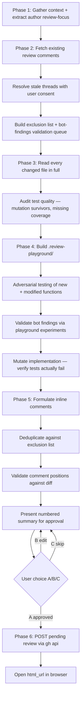

# wk-pr-review

> Thorough, adversarial code review of a GitHub PR — investigates changed code deeply, builds a playground to
> validate assumptions via experiments, and posts a pending review for human submission.

**Version:** `2026.06.12-162234`

## Invocation

| Mode | Trigger |
|------|---------|
| User-invocable | `/wk-pr-review [PR number or URL]` |
| Model-invocable | Automatic on: "review this PR", "review code changes", "create review comments", or "investigate a pull request" |

## How It Works

## Noteworthy

- **HARD RULE — never post without explicit user confirmation:** The pending review is created only after the
  user picks option `A` verbatim. Consent from earlier in the session does not carry forward.
- **Playground is write-sandboxed:** Write and Edit tools may only target `.review-playground/` — never
  production files. The directory is gitignored automatically.
- **Bot findings go through playground validation before reply:** Every active bot comment is reproduced in a
  playground script and classified as Confirmed, Refuted, or Inconclusive. Confirmed findings get silent skip
  (the bot thread already stands); only Refuted findings earn a reply with counter-evidence.
- **`in_reply_to` is invalid in draft review payloads:** The GitHub REST API rejects it with 422. Bot-thread
  replies must either be folded into the review body or posted as live replies — they cannot be embedded in
  the `comments[]` array of the pending review.
- **Author review-focus items must be answered:** Explicit questions or flagged areas in the PR description
  are captured as a `review_focus` list in Phase 1. Every item must be answered inline or in the review body
  before the review is presented — unanswered author asks are a review gap.
- **Mutation testing of PR tests is built-in:** Phase 4 copies implementation files, mutates them (flip
  conditionals, hardcode returns), runs the PR's tests against the mutant, and flags tests that survive. A
  mutation-surviving test provides false confidence.
- **Architecture changes escalate to [`wk-arch-review`](../arch-review/README.md):** Phase 1 detects diffs
  that introduce/alter architecture (design docs, new services/datastores/IaC, trust-boundary or API/contract
  changes, ownership-reshaping migrations) and folds its SPOF / unhappy-path / assumption findings into the
  review as concerns.
