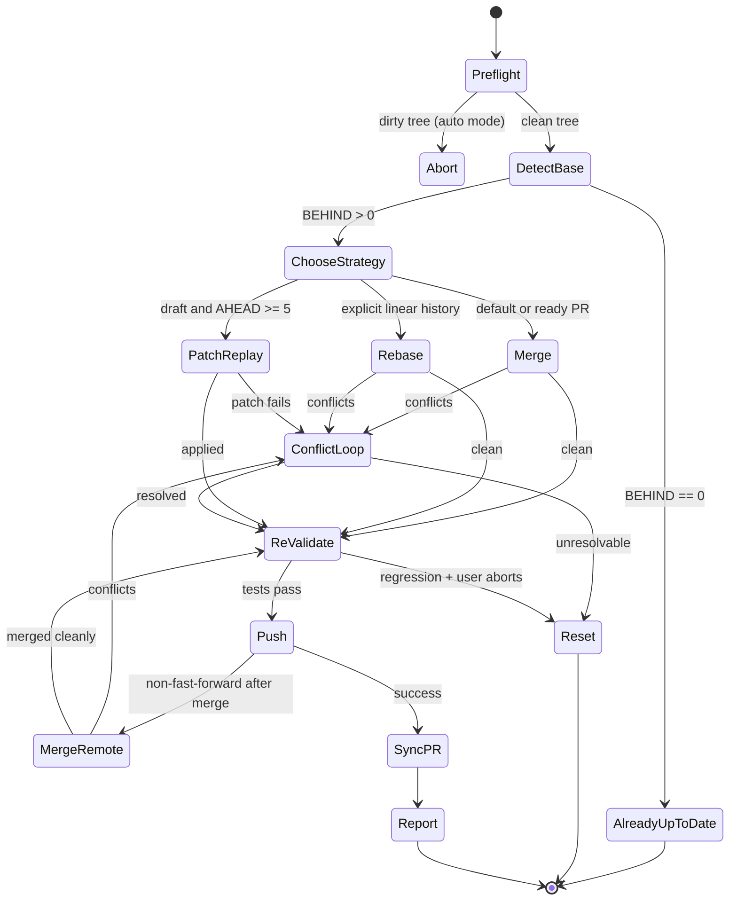

# wk-pr-update

> Bring a PR branch up to date with its base using merge by default,
> patch-replay for a large draft, or rebase on explicit opt-in — with conflict
> resolution, re-validation, and remote-history-safe publishing.

**Version:** `2026.08.18-205145`

## Invocation

| Mode | Trigger |
|------|---------|
| User-invocable | `/wk-pr-update [base-branch]` |
| Model-invocable | Automatic on: "update PR", "rebase on main", "sync with base", "pull in latest from main", or when CI surfaces a base-branch conflict |

## How It Works

## Noteworthy

- **Merge is the default:** It preserves commit SHAs and review anchors. A large
  draft may use patch-replay; rebase requires explicit linear-history opt-in.
- **Push mode follows strategy:** Merge uses normal `git push`. Rebase and
  patch-replay rewrite history and therefore use `--force-with-lease`; plain
  `--force` is forbidden.
- **A remote advance after the local merge is integrated, not overwritten:**
  Fetch and inspect the remote-only commits, merge the fetched SHA, rerun the
  full validation stage, then retry a normal push.
- **Sequential identifiers are reconciled before integration:** Compare new
  allocations on both histories and move the branch-owned artifact to the next
  free identifier before textual conflict resolution.
- **Behavior-preservation check supplements test passing:** After integration, every removed line is scanned
  for env lookups, fallback chains, rescue clauses, and guards. Tests passing proves new paths work; this
  scan proves old paths weren't silently dropped.
- **Dirty tree aborts in auto mode:** The skill requires a clean working tree. Auto mode defaults to abort
  rather than stashing changes on the user's behalf — that mutation is outside the autonomy budget.
- **Invoked by [`wk-pr-resolve`](../pr-resolve/README.md) Step 2:** Rather than inline merge/rebase logic, [`wk-pr-resolve`](../pr-resolve/README.md) delegates
  base-branch integration here so the strategy heuristics and safety nets apply consistently everywhere.
- **[`wk-refactor`](../refactor/README.md) fires after every successful
  integration:** Immediately after integration, the refactor audit runs to catch
  behavior that was dropped by conflict resolution before the PR is pushed.
