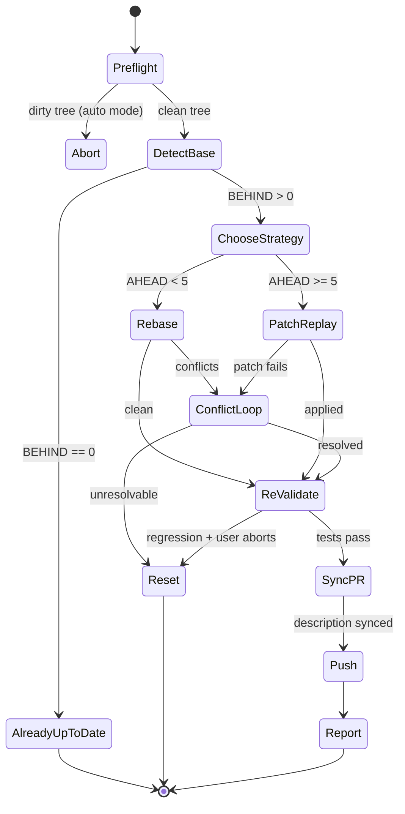

# wk-pr-update

> Bring a PR branch up to date with its base using the right integration strategy — rebase for small branches,
> patch-replay for large ones — with conflict resolution, re-validation, and force-with-lease push.

**Version:** `2026.07.01-213515`

## Invocation

| Mode | Trigger |
|------|---------|
| User-invocable | `/wk-pr-update [base-branch]` |
| Model-invocable | Automatic on: "update PR", "rebase on main", "sync with base", "pull in latest from main", or when CI surfaces a base-branch conflict |

## How It Works

## Noteworthy

- **Two strategies with a 5-commit threshold:** Rebase preserves per-commit history for small branches;
  patch-replay produces one integration commit for large branches (original commits listed in the body for
  traceability). The user can override the heuristic.
- **HARD RULE — `--force-with-lease` only:** `--force` alone silently loses concurrent contributor work.
  `--force-with-lease` aborts if the remote moved; never escalate to plain `--force`.
- **Behavior-preservation check supplements test passing:** After integration, every removed line is scanned
  for env lookups, fallback chains, rescue clauses, and guards. Tests passing proves new paths work; this
  scan proves old paths weren't silently dropped.
- **Dirty tree aborts in auto mode:** The skill requires a clean working tree. Auto mode defaults to abort
  rather than stashing changes on the user's behalf — that mutation is outside the autonomy budget.
- **Invoked by [`wk-pr-resolve`](../pr-resolve/README.md) Step 2:** Rather than inline merge/rebase logic, [`wk-pr-resolve`](../pr-resolve/README.md) delegates
  base-branch integration here so the strategy heuristics and safety nets apply consistently everywhere.
- **[`wk-refactor`](../refactor/README.md) fires after every successful rebase/replay:** Immediately after integration, the refactor
  audit runs to catch behavior that was dropped by conflict resolution before the PR is pushed.
