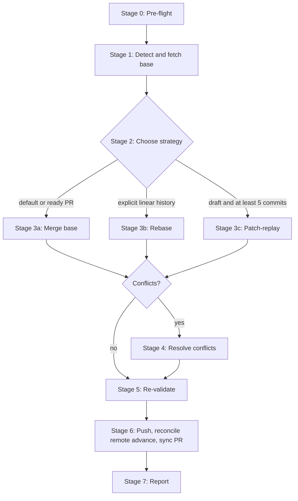

# PR Update

Bring a PR branch up to date with its base → right integration strategy
for the branch's size, conflicts resolved interactively, work re-validated
after integration.



---

## Hard Rules

1. **Never run on a dirty tree.** Stash or commit first; pre-flight refuses otherwise.
2. **Never force-push without `--force-with-lease`.** `--force` alone loses concurrent
   contributor work; lease aborts the push if the remote moved.
3. **Never silently drop commits.** Patch-replay must reproduce the branch's net diff
   exactly; if conflict resolution alters the diff, surface it before pushing.
4. **Never push without re-validation.** Branch must build + pass tests after
   integration, not before.
5. **Never skip PR description sync.** Updating the branch but leaving a stale PR body
   violates `wk-commit`'s PR Sync HARD RULE.
6. **All GitHub reads/writes route through `wk-gh`.** Org scoping per `wk-gh` Step 1–2;
   PR-body sync emits the canonical outbound footer per `wk-gh` Step 4 once at the end
   of the body — never duplicated.
7. **Detect sequential identifier collisions before integration.** Compare new
   allocations on both histories; never leave a same-ID conflict for the merge.

---

## Stage 0: Pre-flight

Confirm the environment is safe to mutate.

```bash
# Must be in a git repo, with a current branch that isn't the base
BRANCH=$(git rev-parse --abbrev-ref HEAD)

# Reject dirty tree
if [ -n "$(git status --porcelain)" ]; then
  echo "Working tree is dirty. Stash or commit before running."
  exit 1
fi

# Capture starting SHA for the safety net
START_SHA=$(git rev-parse HEAD)
```

If the tree is dirty, ask:

> "Working tree has uncommitted changes. (a) stash → run → unstash,
> (b) commit them first via `wk-commit`, (c) abort."

Auto mode defaults to **(c) abort** — picking (a) or (b) on the user's behalf is a
mutation auto mode should not make silently.

---

## Stage 1: Detect base, fetch, compute commit count

Base branch given as argument or inferred:

```bash
# 1. Argument > 2. PR base > 3. repo default
BASE="${1:-$(gh pr view --json baseRefName --jq .baseRefName 2>/dev/null \
            || git symbolic-ref refs/remotes/origin/HEAD --short \
                | sed 's@^origin/@@')}"

# Base may have been merged and deleted; re-detect if fetch fails
if ! git fetch origin "$BASE" 2>/dev/null; then
  BASE=$(gh pr view --json baseRefName --jq .baseRefName)
  git fetch origin "$BASE"
fi
BASE_REF="origin/$BASE"

# Commits the branch is ahead of the base
AHEAD=$(git rev-list --count "$BASE_REF..HEAD")
BEHIND=$(git rev-list --count "HEAD..$BASE_REF")

echo "Branch $BRANCH is $AHEAD ahead, $BEHIND behind $BASE."
```

If `$BEHIND` is 0, branch is already up to date — exit early with a one-line note.
Otherwise continue to strategy selection.

### Sequential identifier collision pre-flight

Before Stage 2, compare artifacts introduced on each side since the merge base
for every repository-wide sequential namespace: architecture decisions,
migrations, schema identifiers, and the repository's equivalents.

- Same identifier allocated to different artifacts → rename the branch-owned
  artifact to the next free identifier across both histories.
- Reconcile filenames, headings, links, indexes, and inline references before
  integration; commit the atomic rename via `wk-commit`, then run merge,
  rebase, or patch-replay from a clean tree.
- Ownership ambiguous → stop and ask which artifact may move; do not resolve by
  taking one side of the later textual conflict.

### Merge-aware `$AHEAD` recomputation

HEAD already contains a base-branch merge commit → raw `$AHEAD` overstates the
integration work (most commits already merged earlier). Recompute against the most
recent base-merge before applying the strategy heuristic:

```bash
LAST_BASE_MERGE=$(git log --merges --first-parent --grep="Merge .*$BASE" \
  --pretty=format:%H -1 2>/dev/null)
if [ -z "$LAST_BASE_MERGE" ]; then
  # Fallback: any merge whose second parent is on the base branch
  LAST_BASE_MERGE=$(git log --merges --first-parent --pretty=format:%H \
    | while read sha; do
        if git merge-base --is-ancestor "$sha^2" "$BASE_REF" 2>/dev/null; then
          echo "$sha"; break
        fi
      done)
fi
if [ -n "$LAST_BASE_MERGE" ]; then
  AHEAD=$(git rev-list --count "$LAST_BASE_MERGE..HEAD" --not "$BASE_REF")
  echo "Branch has prior merge from $BASE; $AHEAD new commits since."
fi
```

Recomputed `$AHEAD` small (`≤ 5`) AND `$BEHIND` small → prefer `git merge "$BASE_REF"`
over rebase or patch-replay; it's a merge-style branch, not rebase-style, and
patch-replay would squash already-reviewed commits.

### Independently-merged parent detection

Stacked branches carry parent commits locally. When those parents merge into base
via separate PRs, any integration strategy replays the duplicated prefix → massive
add/add conflicts on files introduced by both histories.

Detect before Stage 2: compare files added on the branch since the fork point
against files added on base since the fork. Significant overlap → identify the
boundary commit (last parent-originated commit before this branch's own work) and
set `STACKED_PARENT_DETECTED=true`. Stage 2 routes to `rebase --onto` (Stage 3b).

---

### Stacked chains — work bottom-up

A stacked branch is both a review unit and another's base, so moving a parent changes
every descendant's diff, conflict context, and CI basis.

- Rediscover the live stack after each parent update — cached topology is stale the
  moment a parent moves.
- Resolve and verify the parent, integrate that exact tip into its direct child, audit
  every auto-merged overlapping file for intent from both sides, then run the child's
  full gate before moving up. Post replies and resolve threads only after confirming
  the current remote head.
- **A stack-tool rewrite is not proof of new content** — tooling relinearizes
  descendant history after a push, giving new commit IDs over an identical tree. Compare
  trees before redoing work; rc 0 means history-only and nothing to redo, non-zero means
  a real content change to re-integrate and re-validate:

  ```bash
  git diff --quiet <verified-tip> <live-tip>
  ```

## Stage 2: Choose integration strategy

**HARD RULE — merge is the default integration strategy.** Use `git merge "$BASE_REF"`
unless the commit count makes per-commit conflict resolution painful or the user
explicitly asks for clean linear history. Rebase rewrites SHAs, requires force-push, and
loses review-thread anchoring; merge preserves all three.

| `$AHEAD` | Strategy | Why |
|----------|----------|-----|
| **HEAD already has a base-merge, recomputed `$AHEAD ≤ 5`** | `git merge "$BASE_REF"` | Merge-style branch — preserve the merge topology; do not squash already-reviewed commits. |
| **< 5** (no prior base-merge) | `git merge "$BASE_REF"` | Default. Preserves commit SHAs, avoids force-push, keeps review threads anchored. |
| **≥ 5** (no prior base-merge) | Patch-replay | Large commit count → rebasing N commits is N conflict-resolutions; one patch is one. Commit messages are reconstructed from the squashed subject + a body listing the original SHAs for traceability. |
| **≥ 5** but **PR is ready-for-review** (`isDraft = false`) | `git merge "$BASE_REF"` | Override the patch-replay heuristic — squashing already-reviewed commits reshapes the diff under reviewers mid-review. Atomic history is the explicit signal of a ready PR. |
| **Independently-merged parent detected** | Rebase `--onto` (Stage 3b) | Stacked branch carries parent commits that merged separately into base → skip duplicated prefix to avoid add/add conflicts. |
| **User asked for linear history** | Rebase | Explicit opt-in only — never the default. |

Before selecting patch-replay on `$AHEAD ≥ 5`, check PR draft state:

```bash
IS_DRAFT=$(gh pr view --json isDraft --jq .isDraft)
```

If `isDraft = false`, use merge instead and emit a one-line note: "Overriding
patch-replay heuristic — PR is ready-for-review, preserving atomic commit history."

Threshold is a heuristic, not a contract. User can override once at run time:

> "Branch has {AHEAD} commits ahead — picking {strategy}. Override?
> (a) keep {strategy}, (b) force rebase, (c) force patch-replay,
> (d) abort."

Auto mode picks the heuristic without prompting.

---

## Stage 3a: Merge strategy (default)

```bash
git merge "$BASE_REF"
```

- Merge conflicts → enter Stage 4. Clean merge → enter Stage 5.
- Record `strategy=merge`; Stage 6 uses a normal push and preserves both local
  and remote history if the remote branch advances before that push.

---

## Stage 3b: Rebase strategy (explicit opt-in)

```bash
git rebase "$BASE_REF"
```

**Merged-parent branches: rebase `--onto` to skip already-merged commits.** Branch
stacked on a parent that has since merged into base → plain `git rebase "$BASE_REF"`
replays the parent's commits too, producing add/add conflicts on files the parent
introduced. Replay only this branch's own commits:

```bash
# tip SHA of the now-merged parent branch (the old fork point)
git rebase --onto "$BASE_REF" <merged-parent-tip-sha>
```

- Detect: unexpected add/add conflicts on files this branch never touched, right after a
  parent branch merged.
- Find the parent tip via `git log --oneline` (last commit before this branch's own
  work); re-run with `--onto`.
- **Retargeting a child is not rebasing it.** When a parent PR merges, retargeting
  each child's base only changes what the child is compared against — the parent's
  commits remain in the child, so its diff claims that work as its own. Replay each
  retargeted child with `--onto` and force-push; do it when the parent merges, not
  when a reviewer notices.
- **Resolving in place instead of restarting** — merge strategy, parent already
  squash-landed: take `--theirs` for files the squashed parent fully supersedes,
  hand-merge files both histories added to, then gate on the full suite. In a merge
  `--theirs` is the incoming base and `--ours` the PR branch; inverted, this discards
  the branch's own work. Prefer `--onto` whenever the replay has not started yet.

**Base moved / stacked parent merged mid-flight → rebase the WHOLE stack.** Treat a moved
base as a first-class event. When a stacked PR's parent merges externally, or GitHub's
auto-update-branch silently merges the new default into a descendant (injecting an
unrelated lockfile delta and a synthetic `Merge branch …` commit, and retargeting the
base), rebase the entire current stack onto the new base — never patch around the injected
merge or accept the pollution:

```bash
git rebase --onto <newbase> <oldbase> <branch> --update-refs
```

- Detect an auto-merge: the remote branch head is a SHA absent from locally-fetched
  history (a `bad object`/unknown-SHA head). Re-fetch and inspect before trusting local refs.
- **After any `--update-refs` (or stack-rewriting) rebase, verify HEAD before the next Write
  or commit.** `--update-refs` moves branch *pointers* but leaves HEAD on whatever branch was
  checked out for the rebase — not the topmost branch. Run `git branch --show-current` /
  `git status` and explicitly `git checkout` the intended branch, or the next commit lands on
  the wrong branch of the stack.
- **A rebase reporting success may have done nothing.** `git rebase <base>` no-ops
  when `<base>` already equals the merge-base, keeping every SHA; `--rebase-merges`
  does not defeat it. Recreating commits for a side effect (re-sign, re-author) needs
  `--force-rebase`, and the proof is `HEAD != $START_SHA` — never a clean exit.
- Rebase reports conflicts → **conflict resolution loop** (Stage 4). Clean rebase → jump
  to Stage 5.
- Rebase introduces test failures or behavioral regressions (detected in Stage 5) →
  safety net `git reset --hard $START_SHA` restores the pre-rebase state (Stage 6 abort
  path).

---

## Stage 3c: Patch-replay strategy (`$AHEAD ≥ 5`)

Goal: land the branch's **net diff** on the new base as a single integration commit,
preserving traceability to the original commits.

```bash
# 1. Snapshot the net diff against the OLD base (the merge-base, not the
#    new tip — patch-replay is "what did this branch change", not "what
#    happened on main since this branch forked").
OLD_BASE=$(git merge-base HEAD "$BASE_REF")
git diff "$OLD_BASE..HEAD" > /tmp/pr-update-$$.patch

# 2. Capture the original commit log for the integration commit body
git log --reverse --format='- %h %s' "$OLD_BASE..HEAD" > /tmp/pr-update-$$.log

# 3. Reset the branch to the new base
git reset --hard "$BASE_REF"

# 4. Apply the patch
if ! git apply --3way /tmp/pr-update-$$.patch; then
  # Conflicts — fall into the resolution loop with patch context
  echo "Patch did not apply cleanly. Resolving conflicts..."
fi
```

After patch application (clean or post-conflict-resolution), produce **one** integration
commit naming the squashed subject and listing the original commits in the body for
git-log traceability:

```bash
git add -A
git commit -S -m "$(cat <<EOF
<conventional-subject>: <emoji> <one-line summary of the net change>

Squashed via wk-pr-update onto $BASE @ $(git rev-parse --short "$BASE_REF").

Original commits:
$(cat /tmp/pr-update-$$.log)

Co-Authored-By: <agent>
EOF
)"
```

Commit subject MUST follow `wk-commit`'s conventional format with a single emoji
classifier. Clear branch theme → use it; mixed → use 🤖 (the "no single emoji fits"
fallback).

Patch-replay rewrites the branch to one commit — **the original commits are lost from
its git log**, living only in the integration commit's body (the accepted cost at ≥5
commits of not picking "force rebase").

---

## Stage 4: Conflict resolution loop

Merging, rebasing, or patch-applying surfaces conflicts the same way — files
with `<<<<<<<` markers, `git status` listing "both modified."

```bash
git status --short | grep '^UU\|^AA\|^DD'
```

**HARD RULE — never trust a rerere-cached resolution.** When merge/rebase/patch prints
`Staged '<file>' using previous resolution`, `rerere.enabled` silently re-applied a
prior resolution by content hash and left **no conflict markers** — a wrong-direction
cached resolution (e.g. one that dropped this branch's own additions) applies invisibly,
and `git diff --check` finds nothing because the file is already staged.

- Do not accept the staged result. Recreate the real conflict and re-resolve by hand:

  ```bash
  git rerere forget <file>
  git checkout --merge <file>   # restores <<<<<<< markers for manual resolution
  ```

- Hand-verify **both sides are represented** in the final result before staging.
- **Important:** regenerate any build/generate output (schema dumps, digest manifests,
  screenshots, lockfiles) from source and verify; never side-pick or textually resolve.
  Regenerate **once, last** — any later source commit re-invalidates it, so resolve
  either way, mark the path, and generate after all other fixes land, as the final
  pre-push commit.

For each conflicted file:

1. **Read** both sides. Marker labels change meaning by operation: during a
   merge, `HEAD` is the current branch; during a rebase, `HEAD` is the replay
   target; during patch-replay, the other side is the patch. Inspect the named
   refs or index stages instead of assuming one label always means "base."
2. **Decide** the resolution. Prefer keeping the branch's intent (the work being
   integrated is why the PR exists) unless the base change supersedes it (e.g. file
   renamed on base → apply the branch's edits to the new filename).
   - **Lockfile conflict** (`Gemfile.lock`, `package-lock.json`, `Cargo.lock`, …):
     keep the branch's structural changes (remotes, added/removed deps, source
     migration) and re-apply only the base's dependency version bumps onto it —
     never take one whole side. A real install from the resolved manifest
     (Stage 5 pre-check) outranks a clean-looking textual merge.
3. **Verify** the resolved file — open it, scan for stray markers, run a quick syntax
   check (`node --check`, `python -m py_compile`, `cargo check`, etc. — whatever is cheap
   for the language).
4. **Stage**: `git add <file>`.

Auto mode resolves only **trivial** conflicts (one side adds an import the other doesn't
touch; whitespace-only divergence; non-overlapping additions). Anything semantically
meaningful pauses and asks:

> "Conflict in `{path}`:
>   {3-line excerpt of the conflict region}
> (a) keep branch's version  (b) keep base's version
> (c) describe a manual merge  (d) abort"

After all files are resolved:

- **Merge:** `git merge --continue`. Proceed to Stage 5 after the integration
  commit is created.
- **Rebase:** `git rebase --continue`. Loop if more conflicts.
- **Patch-replay:** working tree now has a clean diff → proceed to the integration
  commit (Stage 3c step 4).

Conflicts too tangled to resolve cleanly → **abort** and restore the starting state:

```bash
git merge --abort 2>/dev/null
git rebase --abort 2>/dev/null
git reset --hard "$START_SHA"
```

Tell the user: "Conflicts could not be resolved automatically. The
branch is back to its starting state. Resolve manually via `git
rebase $BASE_REF` and re-run."

---

## Stage 5: Re-validate

Branch now has the base's changes integrated; the work must still build + pass tests
**after** that integration. Pre-integration validation does not transfer.

### Dependency install pre-check

Integration may invalidate the local dependency cache. Before running the test suite,
diff the project's dependency lockfile between pre- and post-integration base. If it
changed, install dependencies first — otherwise a "missing dependency" error
masquerades as a test regression.

Lockfile names, test-command detection signals (first hit wins), and example
invocations: [`references/ecosystem-detection.md`](references/ecosystem-detection.md).
Detect the test command from those signals, then run the suite plus type/lint checks if
cheap.

| Outcome | Action |
|---------|--------|
| All green | Proceed to Stage 6 |
| Tests fail in code the integration touched | Treat as a real regression — diagnose, fix on the integrated branch, re-validate. Do not push a known-broken integration. |
| Tests fail in code unrelated to the integration | Almost always means the base introduced the failure — re-run on `$BASE_REF` to confirm; if reproducible there, surface to the user but do not block the integration push. |
| No test command detected | Note the gap, surface it to the user, proceed (the user accepted the lack of automated coverage when they ran the skill) |

Validation surfaces a regression and user says "abort":

```bash
git reset --hard "$START_SHA"
```

Branch returns to its pre-integration state; retry after fixing what broke it.

### Behavior-preservation check

Tests passing is necessary but **not sufficient** — when both production code and its
spec are picked from the same side of a conflict, the regression is internally
consistent and CI does not catch it.

For every file touched by the integration, diff the integrated result against the
pre-integration base:

```bash
git diff "$START_SHA"..HEAD -- <file>
```

Scan for removed lines in these high-risk categories:

| Category | Examples |
|----------|---------|
| Environment lookups | `ENV.fetch`, `process.env`, `os.environ` |
| Fallback chains | `if x.nil?`, `x || default`, `?? fallback` |
| Error handling | `rescue`, `catch`, `try/except`, `.on_error` |
| Guards / early returns | `unless`, `return if`, `if !x` |
| Spec coverage | removed `it` / `test` / `describe` blocks |

If a removed line's behavior appears nowhere else in the diff, surface
it:

> "Line removed: `{line}` — behavior `{description}` now has no owner.
> Was this intentional?"

Do not push if the user has not answered. A pure integration's net diff should be
narrow; large unexplained deletions warrant line-by-line review, not just a passing test
suite.

---

## Stage 6: Push and sync PR description

Branch is now correct; publish without dropping a concurrent remote advance,
then align the PR with the pushed state.

### Push

- **Merge strategy → normal push.** Never force-push a merge-style branch:

  ```bash
  git push
  ```

- **Non-fast-forward after a local integration commit → fetch, inspect, merge,
  and re-validate.** The remote may have gained another contributor's commit or
  an automated base merge after Stage 1. Preserve both histories:

  ```bash
  git fetch origin "$BRANCH"
  REMOTE_SHA=$(git rev-parse FETCH_HEAD)
  git log --left-right --oneline HEAD..."$REMOTE_SHA"
  git merge "$REMOTE_SHA"
  ```

  Bind the comparison and merge to `FETCH_HEAD`'s resolved SHA; an explicit
  single-branch fetch does not guarantee that `origin/$BRANCH` moved. Inspect
  the left/right log before merging. Unexpected remote scope → stop and surface
  it. Conflict → Stage 4. Clean merge or resolved conflict → rerun all of Stage
  5, then retry a normal `git push`; pre-remote validation does not carry
  forward. Never switch to `--force-with-lease` to bypass the remote commits.
- **Rebase or patch-replay strategy → rewritten history.** Push with a lease:

  ```bash
  git push --force-with-lease
  ```

  Lease rejection means the remote advanced → fetch and restart from Stage 1.
  Never escalate to `--force` or merge the pre-rewrite remote history back into
  a deliberately rewritten branch.

### Sync the PR after the push

Invoke the PR Sync flow from `wk-commit` (HARD RULE: post-push, PR title and body must
reflect the post-push branch state). For patch-replay specifically, also update:

- PR body's commit list / "What's included" section, if present — branch is now one
  squashed commit, not N.
- Metadata lines (issue-closing annotations, co-author trailers, automation blocks,
  ticked test-plan checkboxes) — **HARD RULE:** preserve verbatim per
  `skills/pr/references/pr-description-metadata.md`.

No PR yet (skill ran on a local branch) → skip the sync step and stop after the
validated integration — the user wanted "update", not "create".

---

## Stage 7: Final report

One line per stage actually run:

> "Updated `feat/foo` onto `origin/main`:
> - heads: `<before>` → `<after>`; base `origin/main` @ `<base>`
> - strategy: patch-replay (7 commits → 1 integration commit)
> - conflicts: 2 resolved (auto: 1, asked: 1)
> - validation: 142/142 tests passing, typecheck clean
> - PR #NNN synced and pushed"

Stage skipped (no PR, no test command, etc.) → say so on its line; don't omit the line.

**Always name the branch head before and after, plus the base it landed on** —
rewritten history is not inspectable from the message alone, and both SHAs pre-empt
false-alarm "did you drop my commits?" corrections.
---

## Coordination with other skills

Routing between this skill and `wk-workflow`, `wk-pr`, and `wk-commit`:
[`references/skill-coordination.md`](references/skill-coordination.md).

---

## Quick Reference

| Trigger | Stages |
|---------|--------|
| `/wk-pr-update` | 0 → 7 |
| `/wk-pr-update <branch>` | 0 → 7 with explicit base |
| `wk-workflow` Phase 6 detects "behind base" | 0 → 7 (then resume CI fix loop) |
| Branch already up to date (`$BEHIND == 0`) | Exit at Stage 1 |
| Dirty tree | Abort at Stage 0 unless user picks stash/commit |
| Conflicts unresolvable | Reset to `$START_SHA`, hand back to user |

---

## Post-Completion

Invoke `wk-learn` with this skill's short name as the argument (e.g., `wk-learn pr-update`).
