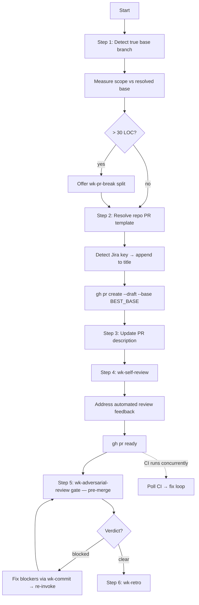

# wk-pr

> Create and manage GitHub pull requests — draft creation, stacking, CI polling, self-review, and marking
> ready — with adversarial review gating every transition.

**Version:** `2026.07.28-082712`

## Invocation

| Mode | Trigger |
|------|---------|
| User-invocable | `/wk-pr [base-branch]` |
| Model-invocable | Automatic on: "create a PR", "open a PR", "push for review", "stack this PR", or "mark PR ready" |

## How It Works

## Noteworthy

- **HARD RULE — always draft first:** PRs are always created with `--draft`. Never create a non-draft PR
  unless the user explicitly requests it.
- **Adversarial review gates the merge, not the publish:** `gh pr create`, pushes, and `gh pr ready` are
  ungated — publishing is reversible. The review runs once after the PR is marked ready, so CI runs alongside
  it, and a `clear` verdict is required before any merge or `--auto` enablement. No size exemption.
- **Fresh CI per push before merge:** Every push that lands new commits starts a new CI run. The skill verifies
  the run for the *current* HEAD SHA has completed and is green before merging — a prior green run against
  older commits never satisfies the gate.
- **Base detection is non-trivial:** The skill computes the closest merge-base across all open PR branches, not
  just `main`. Silent mis-basing causes wrong CI targets and inflated diffs; the detected `$BEST_BASE` is used
  for both `--base` and scope measurement. `gh pr create` is gated on the loop having actually run — never on
  the assumption that a branch "obviously" targets the default. The loop iterates candidates with
  `while IFS= read -r`: an unquoted `for CAND in $CANDIDATES` does not word-split under zsh, which drops every
  candidate and leaves the `999999` sentinel looking like a genuine detection failure.
- **Stacking delegates to `gh stack`:** For a stack of dependent PRs the skill prefers the `github/gh-stack`
  extension (when installed and the repo is enabled for the stacks preview), delegating branch creation, base
  chaining, and linked submission; it falls back to the manual `[<feature>-part-N/M]` + `--base` convention otherwise.
- **Source plan is linked:** Step 2 pre-flights `docs/plans/` for the implementation plan the work derives
  from and links it (anchored to the phase) under `## Meta` — a vision/spec link is not a substitute.
- **PR template detection:** Repo `.github/pull_request_template.md` takes precedence over the hardcoded
  fallback template. Every section must be populated — no placeholders left behind.
- **Jira key suffix is auto-injected:** The title gets `[BOARD-NUM]` appended from the branch name or latest
  commit if a key is found, preventing [`wk-jira`](../jira/README.md) from needing to patch a keyless title post-creation.
- **PR description metadata is preserved:** Before any description rewrite, metadata lines (automation blocks,
  co-author trailers, issue-closing annotations) are preserved per
  `skills/pr/references/pr-description-metadata.md`.
