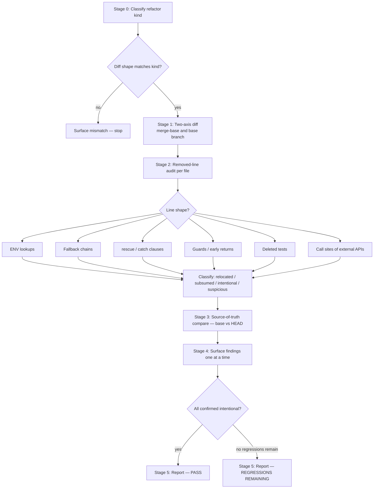

# wk-refactor

> Validate that a refactor preserved behavior — classifies the refactor kind, diffs against both the merge-base
> and base branch, and runs a removed-line audit to catch dropped behavior before "ready for review."

**Version:** `2026.07.28-082712`

## Invocation

| Mode | Trigger |
|------|---------|
| User-invocable | `/wk-refactor [pr-number-or-url]` |
| Model-invocable | Automatic on: after [`wk-pr-update`](../pr-update/README.md) rebase/patch-replay, after [`wk-pr-resolve`](../pr-resolve/README.md) conflict resolution, after extract/move/rename/split operations, or before `gh pr ready` on a movement-dominated diff |

## How It Works

## Noteworthy

- **HARD RULE — green tests ≠ preservation:** The test suite verifies paths that exist; this skill verifies
  paths that *should still exist*. Never claim refactor correctness on a passing suite alone.
- **7 refactor kinds, each with an expected diff shape:** extract-helper, move-file, rename, split-file,
  pure-rebase, inline-helper, collapse. A diff that deviates from the expected shape for its kind is the
  strongest and fastest signal for behavior loss — stop at Stage 0 and surface it.
- **`--theirs`/`--ours` conflict resolutions are automatically suspicious:** When both implementation and spec
  were resolved from the same side, the suite stays green while behavior from the other side silently
  disappears. Every such pair is flagged for manual audit.
- **Behavior narrowed into a conditional is a special case:** An unconditional read moved inside an `if` may
  pass all tests if default values coincide with test inputs. Stage 2 checks test invocations still drive the
  code through the arm that now owns the behavior.
- **Auto-invoked by three skills:** [`wk-pr-update`](../pr-update/README.md) (post-rebase/replay), [`wk-pr-resolve`](../pr-resolve/README.md) (post-conflict),
  and [`wk-pr`](../pr/README.md) (before `gh pr ready` on movement-dominated diffs). Manual invocation is also supported.
- **Report is PR-pasteable:** Stage 5 output is formatted as a `## Refactor audit` block suitable for the PR
  description so reviewers see what was checked.
