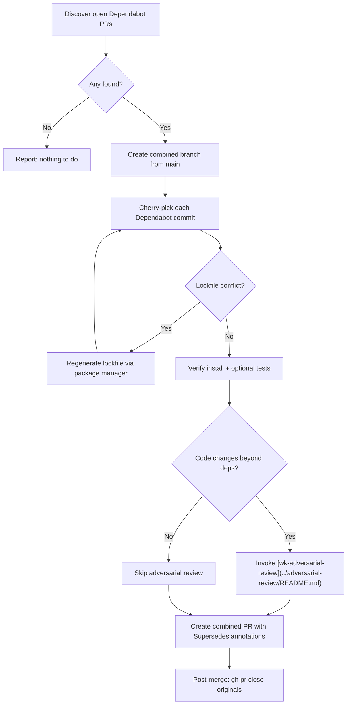

# wk-renovate

> **Version:** 2026.08.20-224826 · **Group:** pull-request · **Model:** sonnet

Batch all open Dependabot PRs in the current repo into a single combined
dependency-update PR — one branch, one review, one merge.

## Why

Dependabot opens one PR per dependency bump. In active repos this creates a
queue of 10–30 open PRs, each needing CI, review, and merge.
[wk-renovate](../renovate/README.md) collapses them into one PR that upgrades
everything at once.

## Trigger

| How | When |
|-----|------|
| `/wk-renovate` | Combine open Dependabot PRs into a single update PR |
| `/wk-renovate cleanup` | Close superseded Dependabot PRs after the combined PR merges |

## Flow

## Key Rules

- **`Closes #N` does not close PRs** — GitHub only auto-closes issues with
  that keyword. Use `Supersedes #N` as documentation and `gh pr close` after
  merge.
- **Adversarial review** runs only when the diff touches application code
  beyond manifests and lockfiles.
- **Automated external review** is always skipped for dependency-only updates.
- **Lockfile conflicts** are resolved by regenerating via the detected package
  manager, not by manual conflict resolution.

## Integration

- Invokes [wk-gh](../gh/README.md) for org-scoped GitHub operations.
- Invokes [wk-adversarial-review](../adversarial-review/README.md) only when
  code changes are detected.
- Invokes [wk-commit](../commit/README.md) for the combined commit.
- Invokes [wk-pr](../pr/README.md) for PR creation.
