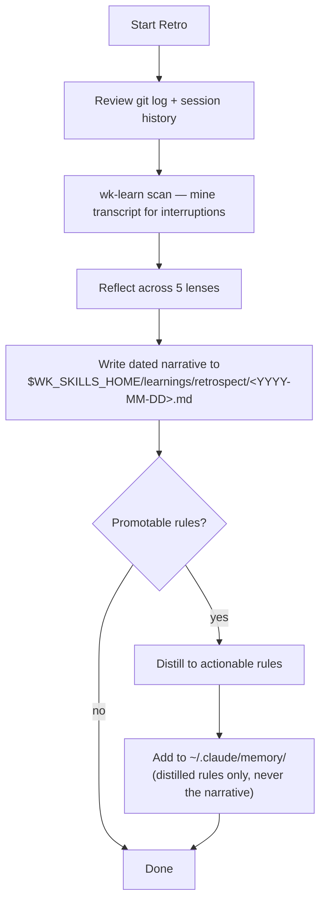

# wk-retro

> Run a session retrospective to capture learnings and improve future sessions.

**Version:** `2026.06.12-021631`

## Invocation

| Mode | Trigger |
|------|---------|
| User-invocable | `/wk-retro` or `/wk-retro "topic"` |
| Model-invocable | automatic: end of every session via [`wk-workflow`](../workflow/README.md) Phase 8 |

## How It Works

## Noteworthy

- **HARD RULE — narrative destination is `$WK_SKILLS_HOME/learnings/retrospect/<YYYY-MM-DD>.md`,
  never `~/.claude/memory/retro-log.md`.** The retrospect log is a skill-improvement input
  consumed by [`wk-sharpen`](../sharpen/README.md); the global memory tree is reserved for
  distilled rules and preferences.
- **HARD RULE: capture in real time, not at retro** — [`wk-learn`](../learn/README.md) `<skill>`
  must be invoked the moment a correction lands, not deferred. Retro is a consolidation pass,
  not first capture.
- **Step 1.5 (`wk-learn scan`) is mandatory** even in auto mode — it walks the transcript to
  extract every user interruption, converting retro from memory-based to evidence-based.
- **Write/Edit tools are scoped to `~/.claude/` and `$WK_SKILLS_HOME/learnings/retrospect/`** —
  the skill cannot write into project directories outside the retrospect log; learnings are
  intentionally global so they travel across all projects.
- The retrospect log holds narratives; `~/.claude/memory/` files hold only the distilled,
  actionable rule — never copy narrative into memory files.
- A Stop hook (`scripts/suggest-retro.sh`) is available for install but is opt-in; the skill
  works fine as a manual invocation.
- Skipping retro at session end is a [`wk-workflow`](../workflow/README.md) violation, not just a suggestion.
