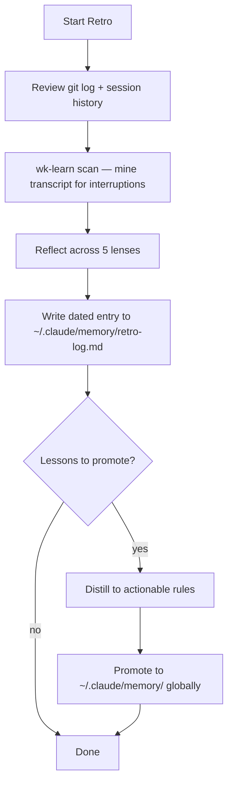

# wk-retro

> Run a session retrospective to capture learnings and improve future sessions.

## Invocation

| Mode | Trigger |
|------|---------|
| User-invocable | `/wk-retro` or `/wk-retro "topic"` |
| Model-invocable | automatic: end of every session via `wk-workflow` Phase 8 |

## How It Works

## Noteworthy

- **HARD RULE: capture in real time, not at retro** — `wk-learn <skill>` must be invoked
  the moment a correction lands, not deferred. Retro is a consolidation pass, not first capture.
- **Step 1.5 (`wk-learn scan`) is mandatory** even in auto mode — it walks the transcript to
  extract every user interruption, converting retro from memory-based to evidence-based.
- **Write/Edit tools are scoped to `~/.claude/` only** — the skill cannot write to project
  directories; learnings are intentionally global so they travel across all projects.
- The retro-log holds narratives; `~/.claude/memory/` files hold only the distilled, actionable
  rule — never copy narrative into memory files.
- A Stop hook (`scripts/suggest-retro.sh`) is available for install but is opt-in; the skill
  works fine as a manual invocation.
- Skipping retro at session end is a `wk-workflow` violation, not just a suggestion.
