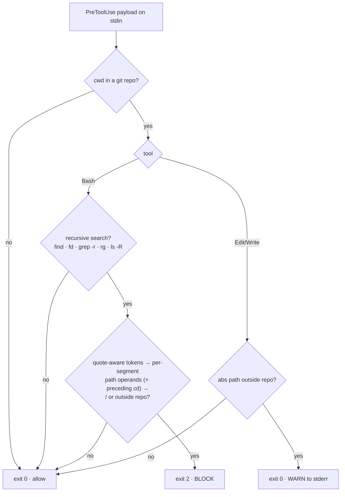

# wk-scope-guard

> A PreToolUse hook that blocks filesystem-root searches and out-of-repo recursive searches, and warns on Edit/Write outside the project root — the mechanical backstop for [wk-plan](../plan/README.md)'s simplest-viable scope gate.

**Version:** `2026.07.25-015339`

## Purpose

Skill text is advisory; under pressure it gets rationalized away. A hook fires
every time and cannot be argued with. This skill is the deterministic
guard against the most frequent scope-creep failure in the transcripts —
searching outside the project ("what are you looking for outside the scope of
the project?") and writing files outside the repo.

## Trigger

- **Auto** — `PreToolUse` hook (matchers `Bash` and
  `Edit|Write|MultiEdit|NotebookEdit`) fires before every matching tool call.
- **Manual** — `/wk-scope-guard --register` (print registration),
  `/wk-scope-guard --test` (run the bats suite).

## How It Works

## Key rules

- Blocks **only** recursive search commands, and **only** when one of their **path
  operands** is `/` or normalizes outside the repo. Absolute paths inside the repo,
  relative paths, and non-search reads (`cat /etc/hosts`) are never blocked.
- **Argument role decides, not token shape.** Only a search segment's path operands
  are checked — a grep-family tool's first positional is the *pattern* (absent under
  `-e`/`-f`), and `find`/`fd` paths precede the first expression flag. So grepping
  repo-relative files *for* absolute-path shapes is allowed, as is an out-of-repo
  path sitting in an unrelated non-search segment. A preceding `cd`/`pushd` outside
  the repo still blocks, because it moves the search's effective root.
- Edit/Write outside the repo **warns, never blocks** — `$HOME/.claude` config
  writes are legitimate.
- `SCOPE_GUARD_OFF=1` bypasses the guard for the session — but it is **the user's to
  grant, never the agent's to self-authorize**. Retrying a blocked search with the var
  added is a bypass attempt; a denial of that retry is the correct outcome and must be
  treated as settled.
- **False blocks are reshaped, not bypassed.** Token inspection is lexical, so three
  shapes read as out-of-scope even when they are not: a path glued to a trailing shell
  separator (`cd <root>;` tokenizes as `<root>;` — the hook strips `;&|)` before
  comparing), a search rooted in another repo's worktree (the root resolves from
  the session's CWD), and a documented `$VAR`-rooted path pasted as an expanded
  literal. Drop the `cd`, use `git grep -n "<term>"`, or leave the path in its
  documented form; ask the user for scope if none fits.
- **Reshape by subtraction, never by swapping the verification method.** Drop only the
  blocked element and keep the prescribed matcher and comparison — a refused check
  rewritten with a different primitive turns a tooling difference into a phantom
  finding, indistinguishable from a real one. When the reported path is not the search's
  own root, it is a preceding `cd`/`pushd` target — drop the `cd` rather than rewriting
  the check. Stage out-of-repo scratch through `Write`/`Edit`, which only warns.
- **A block names the token as written, not the logical path.** Tokens are never
  shell-expanded, so an unexpanded root is not judged at all. That is for diagnosis
  only — never rewrite a literal root into `$VAR` to clear a block. Drive the hook
  with the exact command before reporting that the guard forbids a workflow.
- Tokenization is **quote-aware** (`shlex`), so quoted prose cannot synthesize a path
  argument — a `/` used as a word separator in an `echo` banner no longer blocks a
  fully in-scope search in the same compound command. A quoted out-of-repo root
  (`find "/etc"`) still unwraps and still blocks; unbalanced quotes fall back to a
  whitespace split rather than skipping the check.
- Allows everything when `cwd` is not a git repo (no repo root to reason about).

## Files

- Hook: `skills/scope-guard/hooks/scope-guard.sh` (installed to
  `$HOME/.agents/skills/wk-scope-guard/hooks/`)
  Registered in `$HOME/.claude/settings.json` → `hooks.PreToolUse` via
  `scripts/register-hooks.sh` (declared in `scripts/hooks-manifest.json`)
- Tests: `skills/scope-guard/tests/scope-guard.bats` (34 cases)

To wire this (and every other skill-shipped hook) into a fresh machine, run
`scripts/install-skills.sh` — it installs the skills and then calls
`register-hooks.sh` to merge the manifest into `settings.json` idempotently.

## Related

- [wk-plan](../plan/README.md) — the simplest-viable scope gate this hook enforces.
- [wk-env](../env/README.md) — the other PreToolUse hook skill; same ship-script-plus-registration pattern.
